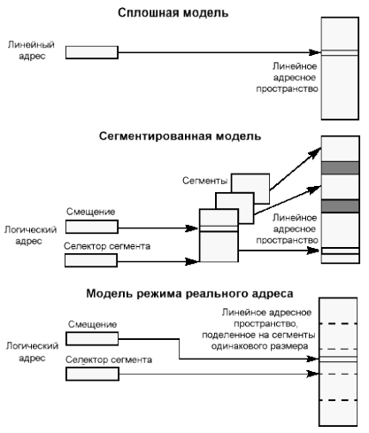
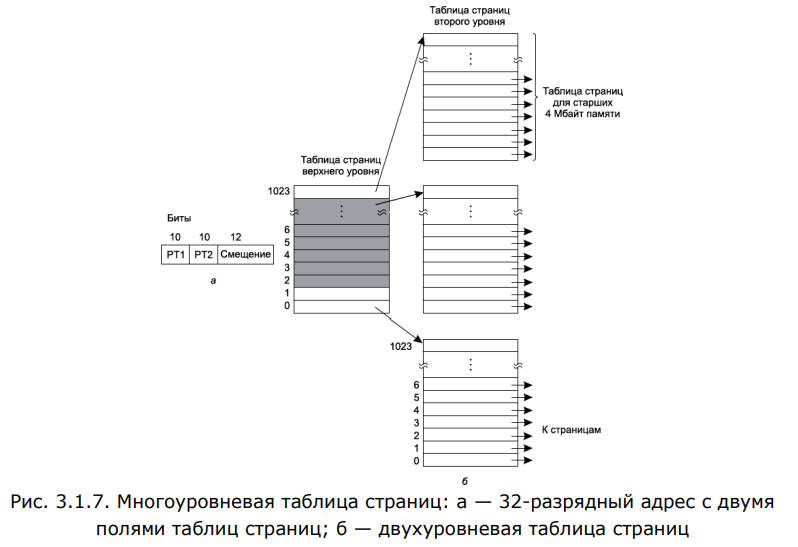
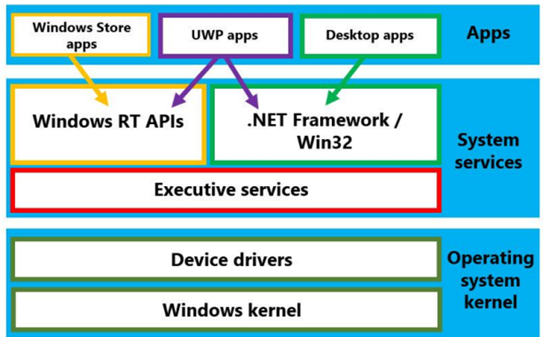
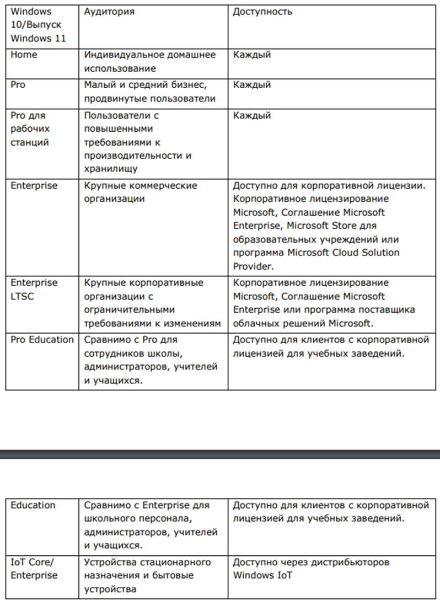
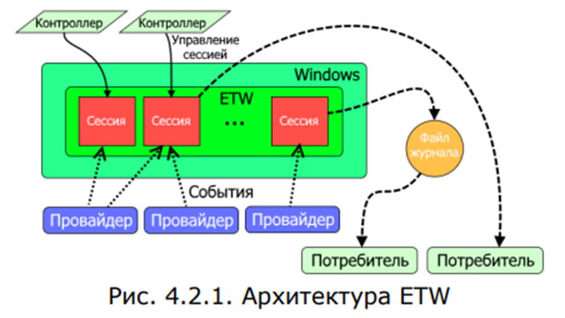
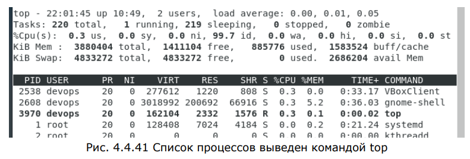

1. Операционные системы: определение, назначение, функции.
	- Операционная система — это комплект программ, которые служат интерфейсом между модулями вычислительных систем и прикладными программными приложениями, а также управляют компьютерным оборудованием и процессами вычислений, эффективным распределением вычислительных мощностей среди процессов вычислений
	- ОС управляет всеми устройствами компьютерной системы (процессорами, оперативной памятью, дисками, клавиатурой, монитором, принтерами, сетевыми устройствами и др.) и обеспечивает пользователя удобным интерфейсом для работы с аппаратурой.
	- Две основные функции (назначение) ОС:
		- предоставлять пользователю некую расширенную виртуальную машину, с которой легче работать (легче программировать), чем непосредственно с аппаратурой реального компьютера или реальной сети;
		- управлять ресурсами вычислительной системы.
	- Поэтому в специальной литературе ОС представляется всегда двояко: как расширенная виртуальная машина и как система управления ресурсами
	- Функции ОС автономного компьютера обычно группируются в соответствии с типами локальных ресурсов, которыми управляет ОС. Такие группы называют подсистемами. Наиболее важные из них:
		- подсистема управления процессами,
		- подсистема управления памятью,
		- подсистема управления файлами,
		- подсистема управления внешними устройствами,
		- подсистема пользовательского интерфейса,
		- подсистема защиты данных и администрирования
	- Функции ОС:
		- прием от пользователя (оператора) заданий или команд, сформулированных на соответствующих языках, и их обработка;
		- загрузка в ОП программ и их исполнение;инициация программы (передача ей управления);
		- прием и исполнение программных запросов на запуск, приостановку, остановку других программ; организация взаимодействия между задачами;
		- идентификация всех программ и данных;
		- обеспечение работы системы управления файлами и/или систем управления БД;
		- обеспечение режима мультипрограммирования (многозадачности);
		- планирование и диспетчеризация задач;
		- обеспечение функций по организации и управлению операциями ввода/вывода;
		- удовлетворение жестким ограничениям на время ответа в режиме реального времени (для соответствующих ОС);
		- управление памятью, организация виртуальной памяти;
		- организация механизмов обмена сообщениями и данными между выполняющимися программами;
		- защита одной программы от влияния другой; обеспечение сохранности данных;
		- аутентификация, авторизация и другие средства обеспечения безопасности;
		- предоставление услуг на случай частичного сбоя системы;
		- обеспечение работы систем программирования;
		- параллельное исполнение нескольких задач.

2. Операционные системы: классификация, основные этапы развития, особенности современного этапа развития
	- Классификация
		- В зависимости от способа организации вычислений:
			- Системы пакетной обработки – основной задачей является организация наибольшего количества вычислительных процессов за единицу времени.
			Определенные процессы объединяются в пакет, который затем обрабатывает ОС.
			- Системы разделения времени – создание возможности единовременного взаимодействия с устройством сразу несколькими людьми. В порядке очереди каждый пользователь получает определенный промежуток процессорного времени.
			- Системы реального времени – организация работы каждой задачи за определенный промежуток времени, присущий каждой конкретной задаче.
		- В зависимости от типа ядра:
			- OС с монолитным ядром;
			- OС с микроядром;
			- OС с гибридным ядром.
		- В зависимости от количества единовременно решаемых задач:
			- однозадачные;
			- многозадачные;
		- В зависимости от количества пользователей:
			- однопользовательские;
			- многопользовательские.
		- В зависимости от количества поддерживаемых процессоров:
			- однопроцессорные
			- многопроцессорные
		- В зависимости от возможности работы в компьютерной сети:
			- локальные – автономные ОС, которые не позволяют работать с компьютерными сетями;
			- сетевые – ОС с поддержкой компьютерных сетей.
		- В зависимости от роли в сетевом взаимодействии:
			- серверные – ОС, открывающие доступ к ресурсам сети и осуществляющие управление сетевой инфраструктурой;
			- клиентские – ОС, которые имеют возможность получения доступа к ресурсам сети.
		- В зависимости от типа лицензии:
			- открытые – ОС с открытым исходным кодом, который можно изучать и редактировать;
			- проприетарные – ОС, связанные с определенным правообладателем и, как правило, имеющие закрытый исходный код.
	- Основные этапы развития
		- Первое (45-55гг)
			- программы в машинных кодах
			- загрузка программы в память вручную или с перфокарт
			- система выполняет одну операцию одновременно (последовательная обработка данных)
			- в самом конце появляется первое системное ПО
		- Второе (55-65гг)
			- использование небольших недорогих компьютеров для записи заданий на магнитную ленту вместо того, чтобы готовить задания непосредственно на больших машинах. Программа, считывающая задания с ленты и запускающая их на выполнение, является прообразом ОС
			- научные и технические вычисления
			- появление настоящих ОС (Fortran Monitor System, IBSYS)
			- разделение труда на операторов, разработчиков и специалистов по эксплуатации
		- Третье (65-80гг)
			- многозадачность (асинхронность)
			- подкачка данных ( способность считывать задание с перфокарт на диск по мере того, как их приносили в машинный зал. При окончании выполнения каждого текущего задания операционная система могла загружать новое задание с диска в освободившийся раздел памяти и запускать это задание)
			- режим разделения времени (вариант многозадачности, при котором у каждого пользователя есть свой диалоговый терминал)
		- Четвёртое (80-05гг)
			- персональные компьютеры
			- MS-DOS
			- сначала текстовый, затем графический интерфейс
			- распределённые операционные системы со свойством масштабируемости
		- Пятое (05-н.в.)
			- многоядерность
			- ОС для смартфонов
			- Android
			- виртуализация (предоставление вычислительных ресурсов, абстрагированное от аппаратной реализации (память, устройства ввода-вывода, ОС и т.д.), например, облачные технологии)
	- Особенности современного развития
		- На современном этапе развития операционных систем на передний план вышли средства обеспечения безопасности. Это связано с возросшей ценностью информации, обрабатываемой компьютерами, а также с повышенным уровнем угроз, существующих при передаче данных по сетям, особенно по публичным, таким как Интернет. Многие операционные системы обладают сегодня развитыми средствами защиты информации, основанными на шифрации данных, аутентификации и авторизации. Современным операционным системам присуща многоплатформенность, т.е. способность работать на совершенно различных типах компьютеров. В последние годы получила дальнейшее развитие долговременная тенденция повышения удобства работы человека с компьютером. Эффективность работы человека становится основным фактором, определяющим эффективность вычислительной системы в целом. Усилия человека не должны тратиться на настройку параметров вычислительного процесса, как это происходило в ОС предыдущих поколений. Постоянно повышается удобство интерактивной работы с компьютером путем включения в операционную систему развитых графических интерфейсов, использующих наряду с графикой звук и видеоизображение

3. Компоненты архитектуры вычислительных систем, их назначение и взаимодействие.
	- Классическая архитектура (фон Нейман)
		- Компоненты
			- АЛУ (арифметические и логические операции)
			- Управляющее устройство, выполняющее процесс выполнения программ
			- Внешнее запоминающее устройство для хранения программ и данных
			- ОЗУ
			- Устройство ввода-вывода информации
	- Шинная архитектура
		- Компоненты
			- **Контроллер** можно рассматривать как специализированный процессор, управляющий работой "вверенного ему" внешнего устройства по специальным встроенным программам обмена. Такой процессор имеет собственную систему команд. Например, контроллер на гибких магнитных дисках (дисковода) умеет позиционировать головку на нужную дорожку диска, читать или записывать сектор, форматировать дорожку и т.п. Результаты выполнения каждой операции заносятся во внутренние регистры памяти контроллера, которые могут быть в дальнейшем прочитаны центральным процессором накопителя
			- Для связи между отдельными функциональными узлами ЭВМ используется **общая шина**. Шина — это несколько проводников, соединяющих несколько устройств. Шины можно разделить на категории в соответствии с выполняемыми функциями. Они могут быть внутренними по отношению к процессору и служить для передачи данных в АЛУ и из АЛУ, а могут быть внешними по отношению к процессору и связывать процессор с памятью или устройствами ввода-вывода
				- Шина данных. По этой шине данные передаются между различными устройствами. Разрядность шины данных определяется разрядностью процессора, т. е. количеством двоичных разрядов, которые процессор обрабатывает за один такт. Со времени создания первого персонального компьютера (1975 г.), разрядность шины данных увеличилась с 8 до 64 бит.
				- Шина адреса. Каждая ячейка оперативной памяти имеет свой адрес. Адрес передается по адресной шине. Разрядность шины адреса определяет адресное пространство процессора, т. е. количество ячеек оперативной памяти, которые могут иметь уникальные адреса. Количество адресуемых ячеек памяти равно 2^n^, где n – разрядность шины адреса. В первых персональных компьютерах разрядность шины адреса составляла 16 бит, в современных персональных компьютерах разрядность шины адреса составляет 64 бита.
				- Шина управления. По шине управления передаются сигналы, определяющие характер обмена информацией по магистрали. Сигналы управления определяют, какую операцию - считывание или запись информации из памяти — нужно производить, синхронизируют обмен информацией между устройствами и т. д.
  			- **Процессор** - "мозг" компьютера. Выбирает команды из ОЗУ и выполняет их. Цикл выплнения: выборка первой команды, декодирование, выполнение до тех пор, пока программа не кончится.
      			Специальные регистры:
				- счётчик команд (адрес следующей команды)
				- адрес вершины стека
				- слово состояния программы (хрен знает, что это такое, но в него входит бит, указывающий, в каком режиме работает программа (пользовательский или ядра))
        		От простого цикла извлечения команд по одной давно отказались, теперь используют **конвейер** - исполнение нескольких команд одновременно. Процессоры с суперскалярной архитектурой имют несколько исполнительных блоков, котооые могут исполнять команды не в порядке следования
				Два режима:
            	- ядра (все команды)
            	- пользовательский (ограниченное множество команд и возможностей)
            	Архитектуры процессоров:
				- CISC (Complex Instruction Set Computer): использование сложных инструкций процессора, выполняющих много действий, написанных на микрокоде (простых командах) и хранящихся в readonly памяти. Микрокод очень сложно отлаживать, нельзя нормально ковейеризировать, потому что инструкции разные по длине выполнения, а пока не декодируешь - не поймёшь, что за инструкция, жрёт больше энергии. Но зато писать ассемблерный код для CISC-процессора быстрее, проще и приятнее
				- RISC (Reduced...): использование нескольких простых команд вместо одной сложной (и вот мы снова тут), т.к. большинство сложных инструкций почти не используются, и можно не заниматься отладкой микрокода. Она оптимизирована для компиляторов, а не для людей. Использует конвейеризацию: разделение инструкций на этапы, каждый из которых выполняется приблизительно одинаково по времени. Пять этапов:
    				- Извлечение команды из памяти и увеличение счётчика команд
    				- Декодирование
    				- Выполнение
    				- Доступ к памяти, если это необходимо
    				- Запись результатов в нужный регистр
  				- RISC-V (Five): открытая, бесплатная, включает в себя небольшой фиксированный набор команд с модульными фиксированными стандартными расширениями. Гибкая, поддерживает инновации (производитель может просто добавить свой модуль команд), снижение затрат и ускорение выхода на рынок
    		- Память
        		- используется иерархия уровней, потому что память физически не может быть и быстрой, и объёмной, и дешёвой
            		- регистры (не уступают в быстродействии процессору)
            		- кеш (обычно делится на кеш-строки по 64 байта)
            		- основная память
            		- магнитный диск
            		- магнитная лента
      		- Шины PCI и PCIe
    			- Первая старше (очевидно) и состоит из собственно шины, к которой подключается вся периферия и мост, соединящий процессор и память (они к шине непосредственно не подключены)
    			- Вторая имеет корневой комплекс вместо моста. У него есть порты, к которым подключаются коммутаторы PCIe, соединяющие несколько устройств PCIe, либо просто устройства PCIe, либо мост PCI, соединяющий корневой комплекс с шиной PCI. Соединения между устрйоствами последовательные и 1-битные вместо 8, 16, 32 и 64-битных у PCI. Какми-то образом это увеличивает пропускную способность. Все взаимодействия являются одноранговыми. Когда процессор хочет обратиться к устройству, он отправляет этому устройству пакет и обычно получает ответ. Пакет проходит через корневой комплекс на материнской плате, а затем передается устройству — как правило, через коммутатор
  			- Шина USB
  			- Видеокарты (устройство, преобразующее цифровую информацию в форму, пригодную для дальнейшего вывода на экран монитора). Может иметь свой графический процессор, снимая эту задачу с ЦП. АПИ для программирования графических приложений:
    			- Direct3D
    			- OpenGL
    			- Vulkan

4. Задачи операционной системы по управлению и организации работы компьютера.
	- Группы функций
    	- Виртуальная память. Механизм виртуальной памяти используется многими операционными системами. Она позволяет создать впечатление, будто у машины больше памяти, чем есть на самом деле.
    	- Файловый ввод-вывод. Это понятие более высокого уровня, чем команды вводавывода, которые мы рассматривали в предыдущей главе.
    	- Параллелизм (как организовано одновременное выполнение нескольких процессов, обмен информацией и синхронизация)
  	- Более подробно
    	- Параллельное функционирование модулей ввода (работающих с блоками, имеющими фиксированный размер и свой адрес (например, жёсткие диски) или байтами (не поддерживают адресацию и поиск информации) (например, сетевые адаптеры)), вывода информации и процессора.
    	- Организация кэширования данных и выполнение согласования скоростей информационного обмена.
    	- Разбиение модулей и информационных данных среди процессов.
    	- Организация удобной работы логического интерфейса между модулями и оставшейся частью системы.
    	- Организация поддержки различных устройств с обеспечением возможности просто их добавить.
    	- Режим динамической загрузки и выгрузки драйверов.
    	- Обеспечение поддержки набора файловых систем.
  	- Главным принципом построения программного обеспечения ввода и вывода информации является разбиение его на отдельные уровни. При этом нижние уровни должны обеспечивать защиту особенностей своего оборудования от влияния верхних уровней, которые призваны только осуществлять удобное интерфейсное обслуживание пользователей. Ещё одним базовым вопросом в организации программ информационного ввода и вывода считается обработка ошибок. Общеизвестно, что обработку ошибок нужно осуществлять максимально близко к оборудованию. Когда контроллер находит ошибку чтения, то ему необходимо сделать попытку её коррекции. Если эта попытка окажется неудачной, то дальше коррекцией ошибки занимается драйвер модуля. Часто ошибки пропадают при повторном выполнении операции ввода или вывода информации. Но когда ликвидацию ошибки не удалось выполнить на нижнем уровне, идёт сообщение об ошибке на верхний уровень
  	- Программное обеспечение ввода и вывода информации делится на следующие уровни:
    	- Уровень обработки прерываний.
    	- Уровень драйверов оборудования
    	- Уровень независимого от оборудования слоя операционной системы.
    	- Пользовательский уровень программного обеспечения
  	- Виртуализация -  технология, которая позволяет создавать несколько сред или выделенных ресурсов из единой физической аппаратной системы. Программное обеспечение, гипервизор, напрямую подключается к этой аппаратной системе и позволяет разбить ее на отдельные, безопасные среды – виртуальные машины. По идее, гипервизор должен распределять аппаратные ресурсы между виртуальными машинами так, чтобы процессы выполнялись быстрее. Физическая машина с гипервизором называется хостом, а виртуальные машины, которые используют ресурсы данного хоста – гостями

5. Структура ядра и его функции. Объекты ядра. Основные операции над объектами ядра. 
    - Структура ядра и его функции
        - Ядро — низкоуровневая основа любой операционной системы, выполняемая аппаратурой в особом привилегированном режиме. Ядро загружается в память один раз и находится в памяти резидентно (постоянно), по одним и тем же адресам. Обеспечивает архитектуру связи с приложениями, организует и регулирует доступ к ресурсам компьютера.
     	- Под архитектурой ОС обычно понимают структурную организацию ОС на основе программных модулей
     	- Обобщённая структура ОС состоит из ядра, окружённого системными услугами, поддержкой сети, работой с устройствами, системой разработки программ, работой с пользователями, приложениями.
     	- Ядро является модулями, выполняющими основные функции ОС:
         	- управление памятью
         	- управление процессами
         	- управление устройствами ввода-вывода
     	- Функции, входящие в состав ядра
         	- внутрисистемные (недоступные для приложений)
         	- апи (обслуживают системные вызовы, предоставляют доступ к системным ресурсам в удобной форме)
       	- Функции модулей ядра — наиболее часто используемые функции ОС, скорость их выполнения определяет производительность всей системы в целом
       	- Остальные модули выполняют полезные, но менее значимые функции:
         	- утилиты — программы, которые решают отдельные задачи управления и сопровождения компьютерной системы (сжатие, дефрагментация …);
         	- библиотеки процедур и функций различного назначения (библиотека математических функций, библиотека функций ввода-вывода и т.д.);
         	- программы предоставления пользователю дополнительных услуг — специальный вариант пользовательского интерфейса, калькулятор, некоторые игры (какие, например, поставляются в составе ОС);
         	- системные обрабатывающие программы — текстовые и графические редакторы, компиляторы, компоновщики, отладчики
       	- Задачи, выполняемые ядром
         	- обработка прерываний
         	- формирование и ликвидация процессов
         	- переключение состояний и диспетчеризация процессов
         	- синхронизация и обмен данными между процессами
         	- ввод и вывод
         	- распределение ресурсов
         	- поддержка файловых систем
       	- Подсистемы
         	- управления процессами (выполняет также распределениесистемных ресурсов между процессами)
         	- управления памятью (оперативной; распределяет память процессам, выгружает их в файл подкачки)
         	- файловая (обеспечивает унифицированный доступ к данным (например, чтобы использование одних и тех же функций выдавало одинаковый результат для файлов, принтеров и терминалов))
         	- ввода-вывода (выполняет запросы файловой подсистемы и подсистемы управления процессами на доступ к периферии. Взаимодействует с программами ядра)
       	- Виды ядер
         	- монолит (по сути, это просто большой набор сервисных функций. Формируется из обширного комплекта абстракций  борудования. Все элементы монолитного ядра работают в едином адресном формате. При такой организации операционной системы все составляющие части её ядра выступают как элементы основной программы, применяют одни и те же системы организации данных и работают друг с другом, используя непосредственный вызов процедуры)
         	- модульная (современная, не требует реструктуризации для разного аппаратного обечпечения, может подгружать разные модули как на лету, так и при переконфигурировании и перезагрузке системы. Но так как все модули работают в режиме ядра, то сбой в одном из них потянет за собой всё ядро, и надо будет перезагружать ОС)
         	- микро (решает небольшой набор задач и имеет небольшой набор абстракций. Главный признак - распределение практически всех драйверов и элементов в процессах сервиса)
         	- экзо (предоставляет только возможность взаимного обмена между процессами и надёжного распределения и высвобождения ресурсов. Распределяет ресурсы между виртуальными машинами и следит, чтобы ни одна из них не лезла в чужие ресурсы)
         	- нано (решает лишь проблему аппаратных прерываний, генерируемых разными блоками компьютера. Передаёт результаты вышестоящей по рангу программе при помощи прерываний)
         	- гибридная (ускоренная модификация микроядра)
         	- комбинированная (коктейль из всего вышеперечисленного)
  	- Объекты ядра
    	- Используются системой и приложениями для управления множеством разных ресурсов (процессов, потоков). Приложения не могут обращаться к ним напрямую. На самом деле это просто блоки памяти, выделенные ядром и доступные только ему. Блок представляет собой структуру данных, в элементах которой содержится информация об объекте. Некоторые элементы (дескриптор защиты, счетчик числа пользователей и др.) присутствуют во всех объектах, но большая их часть специфична для объектов конкретного типа.
    	- **Объект** — это коллекция данных, являющихся частью режима ядра операционной системы, которыми управляет Диспетчер объектов Windows
    	- Категории
        	- устройств
        	- файлов
        	- символические ссылки
        	- разделы реестра
        	- потоки и процессы
        	- диспетчера ядра (события, мьютексы...)
        	- обратного вызова
        	- объекты section
      	- Взаимодествие программ с объектами подчиняется строгим правилам. Когда мы создаем объект ядра в операционной системе Windows, функция возвращает описатель, идентифицирующий созданный объект (HANDLE) (Цитата с MSDN: "Each handle has an entry in an internally maintained table. Those entries contain the addresses of the resources, and the means to identify the resource type"). Все операции с текущим объектом ядра возможны только при передаче этого описателя управляющей функции. При этом использовать один описатель в разных процессах (за одним исключением) низя.
      	- Объекты принадлежат ядру, а не процессу. Завершив создавший его процесс, объект не разрушится, пока есть другие процессы, использующие его. При этом используется счётчик, присваиваемый объекту ядром (+1 или -1, всё такое)
  	- Основные операции над объектами ядра
    	- Система позволяет динамически создавать новые типы объектов. В этом случае предполагается регистрация его методов у диспетчера объектов
    	- Для работы с объектами есть функции фреймворка ОС (CreateFile, OpenMutex...). Это библиотечные процедуры, за которыми стоят сервисы Windows и методы объектов
    	- Функция CreateFile, несмотря на первое впечатление от ее имени, используется и при работе с уже существующими файлами, так как слово File здесь обозначает не файл на диске, а объект ядра типа File
    	- Некоторые объекты ядра имеют разрешение Synchronize. Это означает, что их можно использовать как для синхронизации потоков

6. Утилиты. Системные обрабатывающие программы. Библиотеки процедур. Программы дополнительных услуг. 
	- Утилиты
    	- Системное программное обеспечение, которое помогает поддерживать правильное и бесперебойное функционирование компьютерной системы. Они помогают операционной системе управлять, организовывать, поддерживать и оптимизировать функционирование компьютерной системы
    	- Типы
        	- Антивирусы
        	- Системы управления файлами
        	- Инструменты сжатия
        	- Инструменты управления дисками (например, разбиение на разделы)
        	- Инструменты очистки диска
        	- Дефрагментация диска
        	- Резервного копирования
	- Системные обрабатывающие прграммы
    	- Обрабатывающие системные программы отличаются от управляющих программ как по своим функциям, так и по способу их инициирования (запуска) (каво?)
    	- Функции и тип устройства в зависимости от преобладающей функции:
        	- Перенос информации (между устройствами или в пределах одного устройства) (утилита)
        	- Преобразование информации (после считывания преобразует и лишь затем записывает её дальше) (лингвистический процессор, основная функция которого - перевод описания алгоритма с одного языка на другой (с человеческого на машинный))
            	- транслятор (выдаёт целиком)
                	- компилятор (программа на высоком уровне)
                	- ассемблер (программа на языке ассемблера (какой ужас, что это вообще?))
            	- интерпретатор (выдаёт постепенно), например, PowerShell
	- Библиотеки процедур
        - Библиотеки процедур и функций различного назначения включены в категорию вспомогательных модулей операционной системы. К ним можно отнести библиотеки математических функций, библиотеки функций ввода-вывода и т.д.
        - Библиотеки — это набор функций, которые могут использоваться в различных программах.
            - Статические
            - Динамические
        - Расположение системных библиотек
            - шиндовс: System32, System64
            - linux: /lib, /usr/lib
	- Программы дополнительных услуг
    	- В эту категорию входит большое количество разнообразных программ: специальный вариант пользовательского интерфейса, калькулятор, некоторые игры (какие, например, поставляются в составе ОС)

7. Понятие процесса. Системные и пользовательские процессы. Операции над процессами. 
	- Процесс
 		- Процесс (process) - это некоторая часть (единица) работы, создаваемая операционной системой. Чтобы некоторую часть работы можно было назвать процессом, она должна иметь адресное пространство, назначаемое операционной системой, и идентификатор, или идентификационный номер (id процесса). 
		- Процесс должен обладать определенным статусом и иметь свой элемент в таблице процессов. В соответствии со стандартом POSIX он должен содержать один или несколько потоков управления, выполняющихся в рамках его. Процесс состоит из множества выполняющихся инструкций, размещенных в адресном пространстве этого процесса. Адресное пространство процесса распределяется между инструкциями, данными, принадлежащими процессу, и стеками, обеспечивающими вызовы функций и хранение локальных переменных.
		- Для реализации модели процессов операционная система ведет таблицу (состоящую из массива структур), называемую таблицей процессов, в которой каждая запись соответствует какому-нибудь процессу. Эти записи содержат важную информацию о состоянии процесса, включая счетчик команд, указатель стека, распределение памяти, состояние открытых им файлов, его учетную и планировочную информацию и все остальное, касающееся процесса, что должно быть сохранено, когда процесс переключается из состояния выполнения в состояние готовности или блокировки, чтобы позже он мог возобновить выполнение, как будто никогда не останавливался.
		- Информация о процессах хранится в одной структуре данных, которая называется блоком управления процессом PCB (Process Control Block). Блок управления процессом является моделью процесса для операционной системы. Любая операция, производимая операционной системой над процессом, вызывает изменения в PCB. Содержимое PCB между операциями остается постоянным.
		- Процесс: абстракция, описывающая выполняющуюся программу.
		- Процесс — это просто экземпляр выполняемой программы, включая текущие значения счетчика команд, регистров и переменных. 
		- Разумеется, на самом деле настоящий центральный процессор постоянно переключается между процессами, но чтобы понять систему, куда проще думать о наборе процессов, запущенных в (псевдо) параллельном режиме, чем пытаться отслеживать, как центральный процессор переключается между программами. Это постоянное переключение между процессами называется мультипрограммированием, или многозадачным режимом работы.
		- Процесс — это своего рода действия. У него есть программа, входные и выходные данные и состояние. Один процессор может совместно использоваться несколькими процессами в соответствии с неким алгоритмом планирования, который используется для определения того, когда остановить один процесс и обслужить другой. 
		- Совокупность регистрового, системного и пользовательского контекстов процесса называется контекстом процесса. 
			- Регистровым контекстом процесса называется содержимое всех регистров общего назначения процессора (включая значение программного счетчика). 
			- Содержимое остальных регистров процессора называется системным контекстом процесса. 
			- [Информации, получаемой с регистровых и системных контекстов, достаточно для управления работой процесса в операционной системе.]
			- Пользовательским контекстом называются данные, находящиеся в адресном пространстве процесса.
	- Различают пользовательские процессы и системные. 
		- Процессы, которые выполняют системный код, называются системными и применяются к системе в целом. Они занимаются выполнением таких служебных задач, как распределение памяти, обмен страницами между внутренним и вспомогательным запоминающими устройствами, контроль устройств и т.п. Они также выполняют некоторые задачи «по поручению» пользовательских процессов, например, делают запросы на ввод-вывод данных, выделяют память и т.д.
		- Пользовательские процессы выполняют собственный код и иногда обращаются к системным функциям. Выполняя собственный код, пользовательский процесс пребывает в пользовательском режиме (user mode). В пользовательском режиме процесс не может выполнять определенные привилегированные машинные команды. 
			- При вызове системных функций (например read, write или open) пользовательский процесс выполняет инструкции операционной системы. При этом пользовательский процесс «удерживает» процессор до тех пор, пока не будет выполнен системный вызов. Для выполнения системного вызова процессор обращается к ядру операционной системы. В это время о пользовательском процессе говорят, что он пребывает в привилегированном режиме, или режиме ядра (kernel mode), и не может быть выгружен никаким другим пользовательским процессом.
	- Операции над процессами
		- Запуск процесса (из числа процессов, находящихся в состоянии готовность, операционная система выбирает один процесс для последующего исполнения). 
		- Приостановка процесса (работа процесса, находящегося в состоянии исполнение, приостанавливается в результате какого-либо прерывания). 
		- Блокирование процесса (процесс блокируется, когда он не может продолжать работу, не дождавшись возникновения какого-либо события в вычислительной системе). 
		- Разблокирование процесса (после возникновения в системе какого-либо события операционной системе нужно точно определить, какое именно событие произошло). 
		- Переключение контекста.
  	- Подробнее про создание, завершение, состояния
 		- Создание процесса
   			- При запуске операционной системы создаются, как правило, несколько процессов.
			- Некоторые из них представляют собой высокоприоритетные процессы, то есть процессы, взаимодействующие с пользователями и выполняющие для них определенную работу. 
Остальные являются фоновыми процессами, не связанными с конкретными пользователями, но выполняющими ряд специфических функций.
			- Фоновые процессы, предназначенные для обработки какой-либо активной деятельности, (связанной, например, с электронной почтой, веб-страницами, новостями, выводом информации на печать и т. д.,) называются демонами.
			- В Windows одним вызовом функции Win32 CreateProcess создается процесс, и в него загружается нужная программа.
			- В UNIX существует только один системный вызов для создания нового процесса — fork. Этот вызов создает точную копию вызывающего процесса. После выполнения системного вызова fork два процесса, родительский и дочерний, имеют единый образ памяти, единые строки описания конфигурации и одни и те же открытые файлы. Обычно после этого дочерний процесс изменяет образ памяти и запускает новую программу, выполняя системный вызов execve или ему подобный.
			- В обеих системах, UNIX и Windows, после создания процесса родительский и дочерний процессы обладают своими собственными, отдельными адресными пространствами. 
		- Завершение процесса
 			- Рано или поздно новые процессы будут завершены, обычно в силу следующих обстоятельств:
				- обычного выхода (добровольно);
				- выхода при возникновении ошибки (добровольно);
				- возникновения фатальной ошибки (принудительно);
				- уничтожения другим процессом (принудительно).
			- Системный вызов по окончанию работы процесса: в UNIX - exit, а в Windows — ExitProcess.
   		- Состояния процесса
     		- выполняемый (в данный момент использующий центральный процессор);
			- готовый (работоспособный, но временно приостановленный, чтобы дать возможность выполнения другому процессу);
			- заблокированный (неспособный выполняться, пока не возникнет какое-нибудь внешнее событие).

8. Организация межпроцессного взаимодействия в ОС. Сигналы. Каналы. Классические проблемы межпроцессного взаимодействия.
	- Организация межпроцессного взаимодействия в ОС
      	- Взаимоисключение - проблема, когда каждый процесс, обращающийся к разделяемым данным, исключает для всех других процессов возможность одновременного с ним обращения к этим данным
      	- Уровни IPC
          	- локальный (очевидно, только на локальном компьютере): каналы, разделяемая память, очереди сообщений
          	- удалённый (очевидно, через сеть)
          	- высокоуровневый (обычно подразумеваются пакеты ПО, реализующего промежуточный слой между системной платформой и приложением)
      	- Методы
          	- Сигнал
          	- Файл
          	- Сокет
          	- Канал
          	- Именованный канал
          	- Семафор
          	- Разделяемая память
          	- Обмен сообщениями (без разделения)
          	- File mapping
          	- Очередь сообщений
          	- Почтовый ящик
  	- Сигналы
    	- Сигнал в операционных системах семейства Unix — асинхронное уведомление процесса о каком-либо событии, один из основных способов взаимодействия между процессами. Когда сигнал послан процессу, операционная система прерывает выполнение процесса, при этом, если процесс установил собственный обработчик сигнала, операционная система запускает этот обработчик, передав ему информацию о сигнале, если процесс не установил обработчик, то выполняется обработчик по умолчанию
    	- Классы
        	- системные
        	- от устройств
        	- пользовательские
      	- Части механизма передачи сигналов
        	- установление и обозначение сигналов в виде целочисленных значений
        	- маркер в строке таблицы процессов для прибывших сигналов
        	- таблица с адресами функций, определяющих реакцию на прибывшие сигналы
      	- Как только сигнал приходит, он отмечается записью в таблице процессов. Если этот сигнал предназначен для процесса, то по таблице указателей функций в структуре описания процесса выясняется, как нужно реагировать на этот сигнал. При этом номер сигнала служит индексом таблицы
      	- Варианты реакции на сигнал
        	- вызов собственной функции-обработчика
        	- игнор
        	- использование прдустановленного обработчика
      	- Можно пожалуйста я не буду копипастить все 24 сигнала из таблички? Есть сигнал SIGKILL, он завершает программу
  	- Каналы
    	- Канал (pipe) представляет собой средство связи стандартного вывода одного процесса со стандартным вводом другого. Каналы старейший из инструментов IPC, существующий приблизительно со времени появления самых ранних версий оперативной системы UNIX. Для реализации IPC возможно использование полудуплексных и/или именованных каналов (FIFO)
    	- Для создания канала используется системный вызов pipe(). Его формат следующий:
			```
			#include <inistd.h>
			int pipe (int fd[2]);
			```
		- Аргументом функции является указатель на массив двух целых чисел, в котором функция возвращает два файловых дескриптора. Первый из них предназначен для чтения данных из канала, второй - для записи в него. Читать и писать в канал можно при помощи ```read()``` и ```write()```
  	- Классические проблемы
    	- Синхронный доступ. Если все процессы считывают данные из файла, то в большинстве случае проблем не возникает. Однако, при попытке одним из процессов изменить этот файл, могут возникнуть так называемые конкурентные ситуации (race conditions).
    	- Дисциплина доступа. Если нужно, чтобы как можно большее количество пользователей могли записывать данные, организуется так называемая очередь (по правилу «один пишет, несколько читают»). Практически организуется две очереди: одна — для чтения, другая — для записи. Такую дисциплину доступа можно организовать с помощью барьеров (блокировок). При этом создается общий барьер для считывателей, так как несколько процессов могут одновременно считывать данные, а также отдельный барьер для процесса-писателя. Такая организация предотвращает взаимные помехи в работе.
    	- Голодание процессов. Организация дисциплины доступа может привести к ситуации, когда процесс будет длительно ждать своей очереди для записи данных. Поэтому иногда нужно организовывать очереди с приоритетами
    	- Управление потоком. Если нельзя точно определить, какой из процессов запрашивает или возвращает свои данные в нужный компьютер первым, используется так называемое взаимодействие по модели "клиент-сервер". При этом используются один или несколько клиентов и один сервер. Клиент посылает запрос серверу, а сервер отвечает на него. После этого клиент должен дождаться ответа сервера, чтобы продолжать дальнейшее взаимодействие
    	- Тупик (deadlock). Не маленькие, и так это знаете
    	- Там ещё две задачи: про философов и читателей с писателями, но я их сюда копировать не буду

9.  Концепция потока. Параллельное исполнение потоков. Главный поток процесса. 
	- Поток
 		- Поток выполнения (thread) - наименьшая единица обработки, исполнение которой может быть назначено ядром операционной системы. Несколько потоков выполнения могут существовать в рамках одного и того же процесса и совместно использовать ресурсы, такие как память, тогда как процессы не разделяют этих ресурсов. В частности, потоки выполнения разделяют инструкции процесса (его код) и его контекст (значения переменных, которые они имеют в любой момент времени).
		- Преимущества потоков
			- Код программы может выполняться, даже если некоторые действия заблокированы. 
			- Легкость и быстрота их создания (по сравнению с процессами). 
			- Потоки довольно просто обмениваются данными по сравнению с процессами. 
			- Улучшает общую производительность системы при ожиданиях завершения операций ввода-вывода. 
			- На многопроцессорных системах могут повысить быстродействие за счет параллельных вычислений.
		- Недостатки потоков
			- При программировании приложения с множественными потоками необходимо постоянно думать о потокобезопасности (thread safety). 
			- Один неправильно работающий поток может повредить остальные, так как потоки делят общее адресное пространство. 
			- Потоки конкурируют друг с другом в адресном пространстве. Стек и thread-local storage, занимая часть виртуального адресного пространства процесса, тем самым делают его недоступным для других потоков. 
		- POSIX Threads - стандарт POSIX-реализации потоков. Стандарт POSIX.1c, Threads extensions, определяет API для управления потоками, их синхронизации и планирования. Библиотеки, реализующие этот стандарт (и функции этого стандарта), обычно называются pthreads.
		- В среде Microsoft Windows концепция иная, там процесс - это контейнер для потоков. Процесс-контейнер содержит как минимум один поток. Если потоков в процессе несколько, приложение (процесс) становится многопоточным. Процесс - это исполнение программы. Операционная система использует процессы для разделения исполняемых приложений. Поток - это основная единица, которой операционная система выделяет время процессора.
  		- Классическая модель потоков
			- Процесс является способом группировки в единое целое взаимосвязанных ресурсов. У процесса есть адресное пространство, содержащее текст программы и данные, а также другие ресурсы. Эти ресурсы могут включать открытые файлы, необработанные аварийные сигналы, обработчики сигналов, учетную информацию и т. д. Управление этими ресурсами можно значительно облегчить, если собрать их воедино в виде процесса. У потока есть счетчик команд, отслеживающий, какую очередную инструкцию нужно выполнять. У него есть регистры, в которых содержатся текущие рабочие переменные. У него есть стек с протоколом выполнения, содержащим по одному фрейму для каждой вызванной, но еще не возвратившей управление процедуры. Хотя поток может быть выполнен в рамках какого-нибудь процесса, сам поток и его процесс являются разными понятиями и должны рассматриваться по отдельности. Процессы используются для группировки ресурсов в единое образование, а потоки являются сущностью, распределяемой для выполнения на центральном процессоре. Подобно традиционному процессу (то есть процессу только с одним потоком), поток должен быть в одном из следующих состояний: выполняемый, заблокированный, готовый или завершенный. Каждый поток имеет собственный стек.

		- В Linux потоки реализованы с помощью системного вызова clone(). Также существуют библиотечные функции, которые служат оберткой для системного вызова clone(). В Windows для создания потоков используется функция CreateThread.
		- В Windows процесс активен до тех пор, пока выполняются его обычные, не фоновые потоки. Это не относится к фоновым потокам. Фоновые потоки немедленно завершаются, как только завершились все активные потоки. 
	- Параллельное исполнение потоков
		- Многопоточность: процесс, порождённый в операционной системе, может состоять из нескольких потоков, выполняющихся «параллельно», то есть без предписанного порядка во времени.
		- Одновременное выполнение потоков одного процесса называется параллелизмом (parallelism). Параллельное выполнение потоков в рамках одного процесса возможно только в многоядерных системах и не является обязательным поведением. В одноядерных системах многопоточность может быть только последовательной.
		- Термин "параллельность" в контексте вытесняющей многозадачности операционной системы: операционная система выделяет потоку некоторый квант времени, а затем переключается на другой поток.
		- Все потоки, выполняясь внутри своего процесса, разделяют общую глобальную память — данные и сегменты кучи.
		- Наиболее важные виды взаимодействия параллельных потоков: 
			- совместное использование разделяемых данных (необходим взаимно-исключающий доступ к данным);
			- асинхронное взаимодействие (вводится посредник-буфер между параллельными потоками);
			- синхронное взаимодействие (оба взаимодействующих потока подходят к точке синхронизации, обмениваются данными и затем продолжают работать параллельно и независимо. Если один из потоков подошел к точке синхронизации раньше, то он дожидается партнера).
	- Главный поток
 		- По умолчанию процесс создается с одним потоком, называемым главным или основным потоком. От него могут порождаться другие потоки.

10. Диаграммы состояния потоков. Понятие контекста и переключения контекста.
	- Диаграммы состояния потоков
    	- Состояния:
        	- выполнения (выполняется процессором)
        	- готовности к выполнению (готов и ждёт выделения процессорного времени)
        	- ожидания наступления некоторого события (не претендует на процессорное время)
      	- Переходы (только неочевидные)
        	- выполнения -> готовности
            	- при окончании кванта процессорного времени
            	- при появлении более приоритетного потока
          	- ожидание -> готовность
            	- в системе происходит какое-то событие, наступление готорого ожидает поток
          	- также поток может просто аварийно завершиться
  	- Понятие контекста и переключение контекста
    	- Переключение контекста — в многозадачных ОС и средах — процесс прекращения выполнения процессором одной задачи (процесса, потока, нити) с сохранением всей необходимой информации и состояния, необходимых для последующего продолжения с прерванного места, и восстановления и загрузки состояния задачи, к выполнению которой переходит процессор
    	- Сохраняемая информация
        	- регистры общего назначения
        	- контекст состояния сопроцессора с плавающей точкой
        	- регистры SSE, AVX (x86)
        	- сегментные регистры (x86) (речь идёт о сегментах кода, данных и т.д.)
        	- некоторые управляющие регистры
      	- Структуры ядра ОС, связанные с каждым потоком
        	- общая информация (pid, tid, ...)
        	- состояние процесса/потока
        	- права доступа
        	- используемые ресурсы и блокировки
        	- счётчики использованных ресурсов (например, таймер процессорного времени)
        	- память процесса
      	- Очень важно, при переключении контекста происходит
        	- очистка конвейера команд и данных процессора
        	- Очищается TLB (translation lookaside buffer), отвечающий за страничное отображение линейных адресов на физические
      	- Типы переключения контекста
        	- добровольное (поток сам решил приостановиться)
        	- принудительное
            	- ядро может отобрать управление, потому что кончился квант времени
            	- выполнение блокирующего системного вызова, и ядро решает, что может отобрать управление
            	- использование синхронизирующих примитивов ядра
            	- явная приостановка при помощи системного вызова (sleep, wait, ...)

11. Многозадачность в ОС. Типы многозадачности. 
	- Многозадачность (multitasking) - свойство операционной системы или среды выполнения обеспечивать возможность параллельной (или псевдопараллельной) обработки нескольких задач. Истинная многозадачность операционной системы возможна только в распределённых вычислительных системах.
 	- Типы многозадачности
		- Существует два типа многозадачности: 
			- Процессная многозадачность (основанная на процессах — одновременно выполняющихся программах). Здесь программа — наименьший элемент управляемого кода, которым может управлять планировщик операционной системы. Более известна большинству пользователей (работа в текстовом редакторе и прослушивание музыки). 
			- Поточная многозадачность (основанная на потоках). Наименьший элемент управляемого кода — поток (одна программа может выполнять 2 и более задачи одновременно)
		- К псевдопараллельной многозадачности можно отвести следующие типы:
			- Простое переключение
   				- Загружает в память два или более приложения, но предоставляет процессорное время только основному. Для выполнения фонового приложения оно должно быть активизировано.
   				- Преимущества: Может использовать уже работающие программы без учета многозадачности. 
   				- Недостатки: Ограниченное взаимодействие между программами.
			- Совместная многозадачность (кооперативная):**
				- Задача выполняется после объявления готовности отдать процессорное время другим задачам (задачи сами определяют, когда передавать управление другим задачам). Приложение может захватить фактически столько процессорного времени, сколько оно считает нужным.
				- Преимущества: Упрощает программирование, отсутствие необходимости в защите данных. 
				- Недостатки: Затруднена реализация многозадачной архитектуры ввода-вывода. Если задача не передает управление, она может заблокировать систему, оставив остальные задачи без возможности на выполнение.
			- Вытесняющая многозадачность (приоритетная):**
   				- Операционная система передает управление от одной программы к другой по различным событиям (ОС сама определяет управление между задачами). Распределение процессорного времени осуществляется планировщиком процессов. К тому же каждой задаче может быть назначен пользователем или самой операционной системой определённый приоритет, что обеспечивает гибкое управление распределением процессорного времени между задачами.
				- Преимущества: Быстрый отклик на действия пользователя, полная реализация многозадачного ввода-вывода в ядре ОС.
   				- Недостатки: Требует дисциплины при написании кода, особые требования к реентерабельности и защите данных.
	- Прочее
		- Компьютерная программа в целом или её отдельная процедура называется реентерабельной (reentrant - повторно входимый), если она разработана таким образом, что одна и та же копия инструкций программы в памяти может быть совместно использована несколькими пользователями или процессами. При этом второй пользователь может вызвать реентерабельный код до того, как с ним завершит работу первый пользователь и это как минимум не должно привести к ошибке, а при корректной реализации не должно вызвать потери вычислений. 
			- Для обеспечения реентерабельности необходимо выполнение нескольких условий:
				- никакая часть вызываемого кода не должна модифицироваться;
				- вызываемая процедура не должна сохранять информацию между вызовами;
				- если процедура изменяет какие-либо данные, то они должны быть уникальными для каждого пользователя;
                - процедура не должна возвращать указатели на объекты, общие для разных пользователей.
		- Квантование означает, что каждому потоку система выделяет определенный интервал времени (квант), в течение которого процессор потенциально может выполнять код этого потока. По завершении выделенного кванта планировщик принудительно переключает процессор на выполнение другого готового потока (если, конечно, такой есть), переводя старый активный поток в состояние готовности. Это гарантирует, что ни один поток не захватит ЦП на непозволительно большое время (как было в более ранних системах с так называемой невытесняющей или кооперативной многозадачностью). 

12. Иерархия, приоритеты и планирование потоков. Динамические уровни приоритетов. 
	- Иерархия и приоритеты потоков:
        - Иерархия: Потоки часто группируются по уровням приоритета в зависимости от их важности и роли. Например, системные потоки могут иметь более высокий приоритет по сравнению с прикладными.
        - Приоритеты: Каждому потоку присваивается приоритет, который определяет его относительную важность и влияет на решение о том, какие потоки будут выполнены в первую очередь.
    - Планирование потоков
        - «циклическое планирование»: Одним из самых старых, простых, справедливых и наиболее часто используемых считается алгоритм циклического планирования. Каждому процессу назначается определенный интервал времени, называемый его квантом, в течение которого ему предоставляется возможность выполнения. Если процесс к завершению кванта времени все еще выполняется, то ресурс центрального процессора у него отбирается и передается другому процессу. Разумеется, если процесс переходит в заблокированное состояние или завершает свою работу до истечения кванта времени, то переключение центрального процессора на другой процесс происходит именно в этот момент. Недостаток: Если частые переключения (квант - 4мс, а время переключения равно 1мс), то происходит уменьшение производительности.
        - «приоритетное планирование»: Основная идея проста: каждому процессу присваивается значение приоритетности и запускается тот процесс, который находится в состоянии готовности и имеет наивысший приоритет. Даже если у персонального компьютера один владелец, на нем могут выполняться несколько процессов разной степени важности. Например, фоновому процессу, отправляющему электронную почту, должен быть назначен более низкий приоритет, чем процессу, воспроизводящему на экране видеофильм в реальном времени. Чтобы предотвратить бесконечное выполнение высокоприоритетных процессов, планировщик должен понижать уровень приоритета текущего выполняемого процесса с каждым сигналом таймера (то есть с каждым его прерыванием). Если это действие приведет к тому, что его приоритет упадет ниже приоритета следующего по этому показателю процесса, произойдет переключение процессов. Можно выбрать и другую альтернативу: каждому процессу может быть выделен максимальный квант допустимого времени выполнения. Когда квант времени будет исчерпан, шанс запуска будет предоставлен другому процессу, имеющему наивысший приоритет.
        - «кооперативное планирование»: Это такой алгоритм планирования, при котором процесс получает столько процессорного времени, сколько он считает нужным. Таким образом, все процессы делят процессорное время, периодически передавая управление следующей задаче.
    - Динамические уровни приоритетов: Некоторые системы поддерживают динамическое изменение приоритетов в зависимости от активности и состояния потоков. Например, при потреблении процессорного времени поток может повысить свой приоритет для более частого выполнения. Цель планирования потоков вполне очевидна — определение порядка выполнения потоков в условиях внешней или внутренней многозадачности. Однако способы достижения этой цели существенно зависят от типа ОС. В Windows каждый поток обладает динамическим приоритетом, который система может автоматически изменять для обеспечения отзывчивости и предотвращения голодания потоков. Динамический приоритет изначально совпадает с базовым приоритетом, и его система может повышать или понижать в зависимости от различных условий. Повышение приоритета происходит, например, при перемещении процесса на передний план, получении входных данных или выполнении условий ожидания. После повышения динамического приоритета система постепенно его уменьшает с течением времени. Этот механизм направлен на предотвращение инверсии приоритета и гарантирование эффективного использования процессорного времени

13. Синхронизация и взаимоблокировка ресурсов. Механизмы синхронизации.
	- Синхронизация
		- Ситуации, в которых два (и более) процесса считывают или записывают данные одновременно и конечный результат зависит от того, какой из них был первым, называются состояниями состязания.
		- Критическая область - часть программы, в которой есть обращение к совместно используемым данным.
		- Критический ресурс - ресурс, к которому осуществляется одновременный доступ.
		- Условия для эффективной совместной работы процессов
			- Два процесса не могут одновременно находиться в своих критических областях. 
			- Не должны выстраиваться никакие предположения по поводу скорости или количества центральных процессоров. 
			- Никакие процессы, выполняемые за пределами своих критических областей, не могут блокироваться любым другим процессом. 
			- Процессы не должны находиться в вечном ожидании входа в свои критические области.
		- Синхронизация - механизм упорядочивания выполнения программных блоков двух или более потоков.
			- Синхронизация предполагает наличие общей памяти. В случае потоков проблемы нет, так как потоки разделяют адресное пространство процесса. Но у процессов разобщенные адресные пространства, поэтому нужно найти какое-то решение.
				- Общие структуры хранятся в ядре, для доступа используются системные вызовы.
				- Совместно используемая память. 
				- Общий файл. 
		- В любом случае несколько процессов, использующих общее адресное пространство, никогда не будут столь же эффективными, как потоки, реализованные на пользовательском уровне, поскольку к управлению процессами неизменно привлекается ядро.
	- Механизмы синхонизации
		- Семафор - целочисленная переменная для подсчета количества активизаций, отложенных на будущее. Значение семафора может быть равно 0, что будет свидетельствовать об отсутствии сохраненных активизаций, или иметь какое-нибудь положительное значение, если ожидается не менее одной активизации.
		- Мьютекс - это совместно используемая переменная, которая может находиться в одном из двух состояний: заблокированном или незаблокированном. Следовательно, для их представления нужен только один бит, но на практике зачастую используется целое число, при этом нуль означает незаблокированное, а все остальные значения — заблокированное состояние. Упрощенная версия семафора.
		- Объект критического раздела обеспечивает синхронизацию, аналогичную той, которая предоставляется объектом мьютекса, за исключением того, что критический раздел может использоваться только потоками одного процесса. Объекты критических разделов нельзя совместно использовать в процессах.
		- Объект события - это объект синхронизации, состояние которого может быть явно задано с помощью функции SetEvent. Существуют два типа объекта события:
			- Событие сброса вручную: объект события, состояние которого остается сигнальным до тех пор, пока функция ResetEvent явно не будет сброшена на незначимую. Во время передачи сигнала можно освободить любое количество ожидающих потоков или потоков, которые впоследствии указывают один и тот же объект события в одной из функций ожидания. 
			- Событие автоматического сброса: объект события, состояние которого остается сигнальным до тех пор, пока не будет освобожден один поток ожидания, в этот момент система автоматически устанавливает состояние без знака. Если ожидающих потоков нет, состояние объекта события остается сигнальным. 
		- Заблокированные (Interlocked-) функции предоставляют простой механизм для синхронизации доступа к переменной, совместно используемой несколькими потоками. Эти функции являются атомарными по отношению к вызовам других взаимосвязанных функций. Они реализуется с помощью встроенной функции компилятора, где это возможно. Гарантируют неделимость выполнения операции, предотвращая переключение контекста между потоками.
		- Барьеры: используются для синхронизации группы потоков, ожидающих друг друга перед выполнением следующего этапа работы.
	- Взаимоблокировка ресурсов
		- Под ресурсом понимается все, что должно предоставляться, использоваться и через некоторое время высвобождаться, поскольку в один и тот же момент времени может использоваться только одним процессом. 
		- Взаимоблокировка в группе процессов возникает в том случае, если каждый процесс из этой группы ожидает события, наступление которого зависит исключительно от другого процесса из этой же группы. Поскольку все процессы находятся в состоянии ожидания, ни один из них не станет причиной какого-либо события, которое могло бы возобновить работу другого процесса, принадлежащего к этой группе, и ожидание всех процессов становится бесконечным.
		- Ресурсной взаимоблокировкой называется такой вид взаимоблокировки, когда событием, наступления которого ожидает каждый процесс, является высвобождение какого-либо ресурса, которым на данный момент владеет другой участник группы.

14. Взаимоблокировка ресурсов в многозадачных системах. Решение задачи взаимоблокировки ресурсов. 
	- Взаимоблокировка в группе процессов возникает в том случае, если каждый процесс из этой группы ожидает события, наступление которого зависит исключительно от другого процесса из этой же группы. для возникновения ресурсных взаимоблокировок должны выполняться четыре условия: 
        1. Условие взаимного исключения. Каждый ресурс либо выделен в данный момент только одному процессу, либо доступен. 
        2. Условие удержания и ожидания. Процессы, удерживающие в данный момент ранее выделенные им ресурсы, могут запрашивать новые ресурсы. 
        3. Условие невыгружаемости. Ранее выделенные ресурсы не могут быть принудительно отобраны у процесса. Они должны быть явным образом высвобождены тем процессом, который их удерживает. 
        4. Условие циклического ожидания. Должна существовать кольцевая последовательность из двух и более процессов, каждый из которых ожидает высвобождения ресурса, удерживаемого следующим членом последовательности.
	- Решение задачи взаимоблокировки ресурсов 
    	- Чаще всего для борьбы с взаимными блокировками используются четыре стратегии:
        	- Игнорирование проблемы. Может быть, если вы проигнорируете ее, она проигнорирует вас.
        	- Обнаружение и восстановление. Дайте взаимоблокировкам проявить себя (не блокировать сразу же), обнаружьте их и выполните необходимые действия.
        	- Динамическое уклонение от них за счет тщательного распределения ресурсов.
        	- Предотвращение за счет структурного подавления одного из четырех условий, необходимых для их возникновения (одного из 4 которые описаны выше).

15. Компьютерное время. Ожидаемые таймеры.
	- Компьютерное время
		- Определение секунды в Международной системе единиц (СИ) основано на периодах колебания атома цезия-133 .
		- Международное атомное время (TAI, фр. Temps Atomique International) — время, в основу измерения которого положены электромагнитные излучения, излучаемые атомами или молекулами при переходе из одного энергетического состояния в другое.
		- Всемирное время (UT) – имеет несколько версий стандарта, базируется на вращении Земли относительно далёких объектов.
		- UT1, или универсальное время — основная версия всемирного времени. UT1 вычисляется пропорционально углу вращения Земли относительно международной небесной системы координат (ICRS).
		- UTC – атомная шкала времени, аппроксимирующая UT1. Это международный стандарт, на котором базируется время часовых поясов. В UTC в качестве единицы времени используется секунда СИ, поэтому UTC идёт синхронно с международным атомным временем (TAI). Для синхронизации с UT1 используется секунда синхронизации, которая прибавляется или вычитается по мере необходимости 
		- Локальное (местное) время служит для того, чтобы солнечный день приходился приблизительно на один и тот же промежуток времени.
		- Unix-время (также POSIX-время) — система описания моментов во времени, принятая в Unix и других POSIX-совместимых операционных системах [3]. Определяется как количество секунд, прошедших с полуночи (00:00:00 UTC) 1 января 1970 года; этот момент называют эпохой Unix.
		- Время Windows — это количество времени в миллисекундах, прошедшее с момента последнего запуска системы.
		- Время прерывания - это время с момента последнего запуска системы в интервалах по 100 нс. 
		- WinAPI
			- GetTickCount[64] – количество миллисекунд с момента запуска системы
			- GetSystemTimeAsFileTime - Извлекает текущую системную дату и время (FILETIME)
			- GetSystemTimePreciseAsFileTime - извлекает текущую системную дату и время с максимально возможной точностью (<1 мкс) (FILETIME)
			- Get(/Set)TimeZoneInformation - Текущие параметры часового пояса (TIME_ZONE_INFORMATION)
			- GetLocalTime – Извлекает текущую локальную дату и время(SYSTMEEMTIME)
			- GetSystemTime – текущее время UTC (SYSTEMTIME)
			- структура SYSTEMTIME: можно получить конкретные значения от мс до года
			- структура FILETIME: 64-разрядное значение (нужно использовать FileTimeToSystemTime)
		- POSIX API
			- структура time_t – хранит количество секунд, прошедших с начала эпохи, каждый 4й год високосный (!)
			- структура tm - Для более удобного представления календарного времени (от с до года, день недели и года, летнее время)
			- time_t time(time_t*) - текущее время
			- tm *localtime(const time_t *) - местное время из time_t
			- tm *gmtime(const time_t *) - UTC время
			- time_t mktime(tm *) - из tm в time_t
			- char *asctime(const  tm *) - в строку
			- char *ctime(const time_t *) - в строку
			- strftime - из tm  форматированную строку
		- Часы LINUX: Ядро таймеров POSIX.1b представляет собой набор часов, которые используются как привязка ко времени. 
			- CLOCK_REALTIME: общесистемные часы реального времени (для абсолютного ожидания);
			- CLOCK_MONOTONIC: время непрерывной работы системы (для относительного времени ожидания, периодических задач);
			- CLOCK_PROCESS_CPUTIME_ID: часы, измеряющие время работы процесса;
			- CLOCK_THREAD_CPUTIME_ID: часы, измеряющие время работы текущего потока;
		- Системное Время:
			- Системный таймер служит для отслеживания хода времени ядром: это обеспечение механизма управления прерываниями, которые возникают периодически с постоянной частотой   
			- Real-Time Clock (ЧРВ): электронная схема, предназначенная для учёта хронометрических данных (текущее время, дата, день недели и др.), представляет собой систему из автономного источника питания и учитывающего устройства.
	- Ожидаемые таймеры
		- Объект таймера ожидания — это объект синхронизации, состояние которого по достижении указанного срока устанавливается в значение Signaled. Существует два типа таймеров ожидания, которые можно создать: сброс вручную и синхронизация. Таймер любого типа также может быть периодическим. 
			- Таймер сброса вручную - Таймер, состояние которого остается сигнальным до вызова SetWaitableTimer, чтобы установить новое время выполнения. 
			- Таймер синхронизации - Таймер, состояние которого остается сигнальным до тех пор, пока поток не завершит операцию ожидания в объекте таймера. 
			- Периодический таймер - Таймер, который повторно активируется каждый раз, когда истечет указанный период, пока таймер не будет сброшен или отменен. 
		- Поток использует функцию CreateWaitableTimer или CreateWaitableTimerEx для создания объекта таймера. Поток создания указывает, является ли таймер таймером сброса вручную или таймером синхронизации. Создающий поток может указать имя объекта таймера. Потоки в других процессах могут открывать дескриптор для существующего таймера, указывая его имя в вызове функции OpenWaitableTimer. Поток вызывает функцию SetWaitableTimer для активации таймера. Поток может использовать функцию CancelWaitableTimer для установки таймера в неактивное состояние. Чтобы сбросить таймер, вызовите SetWaitableTimer. Завершив работу с объектом таймера, вызовите CloseHandle, чтобы закрыть дескриптор для объекта таймера.
16. Управление памятью: адресное пространство процесса, организация памяти, основные механизмы управления памятью, концепция рабочего множества. 
	- Адресное пространство процесса
    	- Адресное пространство — это набор адресов, который может быть использован процессом для обращения к памяти
    	- У каждого процесса имеется собственное адресное пространство, независимое от того адресного пространства, которое принадлежит другим процессам (за мааленькими исключениями)
    	- Адресное пространство процесса состоит из диапазона адресов, которые выделены процессу, и, что более важно, в этом диапазоне выделяются адреса, которые процесс может так или иначе использовать. Каждому процессу выделяется "плоское" 32- или 64-битовое адресное пространство. Термин "плоское" обозначает, что адресное пространство состоит из одного диапазона адресов (например, 32-разрядное адресное пространство занимает диапазон адресов от 0 до 429496729)
    	- Секции памяти
        	- код
        	- данные (инициализированные переменные)
        	- неинициализированные глобальные переменные
        	- стек процесса пространства пользователя (не путать со стеком процесса в пространстве ядра, который управляется и используется ядром)
        	- доп. сегменты каждой библиотеки, загружаемой в адресное пространство процесса
        	- все file mappingи
        	- все области совместно используемой памяти
        	- все анонимные отображения в память
	- Организация памяти
    	- Физические адреса — это реальные адреса, используемые для выбора микросхем физической памяти, содержащих данные. Физическая память организована в виде последовательности 8-разрядных байтов. Каждому байту присвоен уникальный адрес
    	- Модели доступа к памяти
        	- плоская
        	- сегментированная
        	- модель режима реального адреса
      	- 
	- Основные механизмы управления памятью
    	- Свопинг - процесс выгружается и загружается в ОЗУ полностью. Используются списки занятых и незанятых сегментов памяти
        	- первое подходящее (ищет первый подходящий незанятый сегмент нужного размера)
        	- следующее подходящее (то же самое, но при следующем поиске начинает искать оттуда, где остановился в прошлый раз, а не с самого начала)
        	- наиболее подходящее (ищет самый маленький сегмент из подходящих)
        	- наименее подходящее (ищет самый большой сегмент, чтобы наверняка)
        	- быстро искомое подходящее (использует отдельные списки для самых востребованных размеров сегментов)
      	- Виртуальная память - разбиение всей памяти на страницы фиксированного размера с непрерывным множеством адресов, выделение процессу памяти страницами
        	- Диспетчер памяти - аппаратный компонент компьютера, который обрабатывает все операции с памятью и кэшированием, связанные с процессором.
			Виртуальные адреса не выставляются напрямую на шине памяти. Вместо этого они поступают в диспетчер памяти, который отображает вирутальные адреса на реальные
			- Работа MMU
    			- аппаратное управление памятью (контроль и регуляция использования процессором ОЗУ и кеша)
    			- управление памятью ОС (обеспечение наличия достаточного количества памяти у процессов)
    			- управление памятью приложений (выделение памяти процессам и переиспользование её после того, как процесс завершается)
  			- Типы памяти
    			- Логическая (виртуальная)
    			- Физическая (реальная)
  			- Таблицы страниц используются для отображения виртуальных страниц на страничные блоки
    			- Запись состоит из номера страничного блока (вроде это реальный адрес страницы), бита присутствия/отсутствия (в реальной памяти), битов защиты (например, на чтение, запись, исполнение), бита изменения (имеет значение, когда ОС решает восстановить страницу. Если она не изменялась, то он страницы можно просто отказаться, потому что последняя версия и так лежит на диске) и бита ссылки (помогает ОС выбрать отселяемую страницу при возникновении ошибки отсутствия страницы. Если к странице не было обращений, её можно смело выкидывать).
  			- Буферы быстрого преобразования адреса (Translation Lookaside Buffer, TLB) используются для ускоренного доступа к часто используемым страницам и хранят их. Если при попытке найти нужную страницу в TLB её там нет, происходит поиск в обычной таблице страниц, и страница помещается в TLB
    			- Ошибки отсутствия записей
        			- программная (страница есть в памяти, но не в TLB, нужно просто обновить TLB)
        			- аппаратная (страницы нет ни в памяти, ни в TLB, ошибка обрабатывается в миллион раз медленнее программной)
  			- Таблицы страниц для больших объёмов памяти
    			- подход первый: многоуровневая таблица 
    			- подход второй: инвертированные таблицы (одна запись для каждого страничного блока в реальной памяти, а не для каждой страницы в вируальном пространстве. Экономит много места, но сильно усложняет преобразование виртуальных адресов в реальные, потому что теперь нужно просматривать всю таблицу для поиска нужной страницы. Решается использованием TLB и хеш-таблиц)
	- Концепция рабочего множества
    	- Рабочий набор процесса — это набор страниц в виртуальном адресном пространстве процесса, которые в настоящее время находятся в физической памяти. Рабочий набор содержит только страничные выделения памяти. В рабочий набор не включаются ресурсы памяти, не допускающие подкачку, такие как расширения адресных окон (AWE) или большие страницы
    	- Если процесс ссылается на страницу памяти, которая в настоящее время не входит в рабочий набор, происходит ошибка страницы. Обработчик ошибки системной страницы пытается устранить ошибку страницы, и в случае успеха страница добавляется в рабочий набор
    	- Ошибка жесткой страницы должна быть устранена путем чтения содержимого страницы из резервного хранилища страницы, которое является системным файлом подкачки или файлом, сопоставленным в памяти, созданным процессом. Ошибка мягкой страницы может быть устранена без доступа к резервному хранилищу. Ошибка мягкой страницы возникает в следующих случаях:
        	- Страница находится в рабочем наборе какого-то другого процесса, поэтому она уже находится в памяти.
        	- Страница находится в состоянии перехода, так как она либо была удалена из рабочих наборов всех процессов, которые использовали страницу и еще не была перепрофилирована, либо она уже находится в результате операции предварительной выборки диспетчера памяти.
        	- Процесс впервые ссылается на выделенную виртуальную страницу (иногда это называется ошибкой с нулевым спросом)
    	- Страницы можно удалить из рабочего набора в следующих случаях:
        	- процесс уменьшает свой рабочий набор явно при помощи, например, SetWorkingSetSize
        	- процесс отменяет представление файла
        	- диспетчер памяти проводит обрезание рабочего набора
        	- диспетчер памяти должен заменить существующую страницу другой, например, из-за того, что текущий рабочий набор уже имеет максимальный размер

17. Классификация запоминающих устройств. Иерархия памяти. Оперативные и постоянные запоминающие устройства.
	- Классификация ЗУ
 		- Запоминающее устройство — носитель информации, предназначенный для записи и хранения данных. В основе работы запоминающего устройства может лежать любой физический эффект, обеспечивающий приведение системы к двум или более устойчивым состояниям. 
		- Классификация запоминающих устройств по устойчивости записи и возможности перезаписи: 
			- Постоянные (ПЗУ), содержание которых не может быть изменено конечным пользователем (например, BIOS). ПЗУ в рабочем режиме допускает только считывание информации. 
			- Записываемые (ППЗУ), в которые конечный пользователь может записать информацию только один раз (например, CD-R). 
			- Многократно перезаписываемые (ПППЗУ) (например, CD-RW). 
			- Оперативные (ОЗУ) — обеспечивают режим записи, хранения и считывания информации в процессе её обработки. Информация исчезает после отключения от источника питания (например, тока). 
		- По типу доступа ЗУ делятся на: 
			- устройства с последовательным доступом (например, магнитные ленты). 
			- устройства с произвольным доступом (RAM) (например, оперативная память). 
			- устройства с прямым доступом (например, жесткие магнитные диски). 
			- устройства с ассоциативным доступом (специальные устройства, для повышения производительности БД) 
		- Классификация запоминающих устройств по геометрическому исполнению: 
			- дисковые (магнитные диски, оптические, магнитооптические); 
			- ленточные (магнитные ленты, перфоленты); 
			- барабанные (магнитные барабаны); 
			- карточные (магнитные карты, перфокарты, флэш-карты, и др.) 
			- печатные платы (карты DRAM). 
		- Классификация запоминающих устройств по физическому принципу: 
			- перфорационные (перфокарта; перфолента); 
			- с магнитной записью (ферритовые сердечники, магнитные диски, магнитные ленты, магнитные карты); 
			- оптические (CD, DVD, HD-DVD, Blu-ray Disc); 
			- использующие эффекты в полупроводниках (флэш-память) и другие
	- Иерархия памяти
 		- Современная система памяти образует иерархию от быстрых типов памяти маленького размера ("вверху") до медленных типов памяти большого размера ("внизу").
		- Конкретный уровень иерархии кэширует или является кэшем для данных, расположенных на более низком уровне. Когда процессор хочет получить какие-то данные, он их сперва ищет на самых быстрых высоких уровнях. И спускается на более низкие (более медленные), если не может найти.
			- несколько регистров процессора (0 тактов)
			- несколько КБ кэш-памяти 1-го уровня (4 такта)
			- пара сотен КБ кэш-памяти 2-го уровня (10)
			- несколько МБ кэш-памяти 3-го уровня (50)
			- оперативная память (200)
			- буфер диска (100'000)
			- локальный диск (10 млн)
			- удалённые сервера (1 млрд)
		- Резервные копии данных можно хранить на магнитных лентах.
	- ПЗУ, ОЗУ
		- ПЗУ - это место в компьютере, где хранятся важные программы, например, управление процессором, программы для запуска и выключения компьютера, а также тестовые программы для проверки работы различных блоков. Он также содержит информацию о том, где находится операционная система на диске.
		- ОЗУ - это место, где компьютер хранит данные и команды, которые ему нужны в данный момент для выполнения операций. ОЗУ передает данные процессору, обычно через кэш-память. Каждая ячейка в ОЗУ имеет свой уникальный адрес. Устанавливается в виде модулей объемом до 64 ГБ, таких как DIMM, и использует разные поколения DDR-памяти, которые отличаются по быстродействию и другим характеристикам.

18. Виртуальная память. Структуризация адресного пространства виртуальной памяти. Задачи управления виртуальной памятью.
	- Виртуальная память
    	- Физические адреса являются конкретными и окончательными — без трансляции, без подкачки, без проверки привилегий. Вы выставляете их на шину и всё: выполняется чтение или запись. Однако в современной операционной системе программы используют абстракцию — виртуальное адресное пространство. Каждая программа пишется в такой модели, что она выполняется одна, всё пространство принадлежит ей, код использует адреса логической памяти, которые должны быть преобразованы в физические адреса до того, как будет выполнен доступ к памяти. Логический адрес на x86 состоит из двух частей: селектора сегмента и смещения внутри сегмента. Процесс трансляции включает два шага: 
        	- учёт сегментного селектора и переход от смещения внутри сегмента к некоторому линейному адресу;
        	- перевод линейного адреса в физический.
	- Структуризация адресного пространства виртуальной памяти
    	- Режимы адресации
        	- реальный (сначала вы устанавливаете сегментный регистр, по сути говоря «так, я хочу работать с куском памяти начиная с адреса X»; затем 16-битный адрес уже используется как смещение в рамках этого куска)
        	- защищённый (также используется сегментированная модель памяти, однако уже организованная по другому принципу: расположение сегментов описывается специальными структурами (таблицами дескрипторов), расположенными в оперативной памяти. Эти таблицы: глобальная и локальная (Global/Local Descriptor Table))
        	- длинный (нет сегментации, большинство сегментных регистров устанвливаются в 0, не используется таблица LDT, но используется GDT)
      	- Там что-то про кольца, но я его трубу шатал это переписывать, если честно
    	- Ставится задача транслировать 48-битный виртуальный адрес в физический. Она решается аппаратным обеспечением — блоком управления памятью (memory management unit, MMU). Этот блок является частью процессора. Чтобы транслировать адреса, он использует структуры данных в оперативной памяти, называемые таблицами страниц. Вместо двухуровневой системы таблиц страниц, используемой системами с 32-битной архитектурой x86, системы, работающие в длинном режиме, используют четыре уровня таблицы страниц
    	- Наиболее часто используемые размеры страниц:
        	- 4кб
        	- 2мб
        	- 1гб
      	- Пусть для определённости размер страницы равен 4 КБ. Значит, младшие 12 битов адреса кодируют смещение внутри страницы и не изменяются, а старшие биты используются для определения адреса начала страницы
	- Задачи управления виртуальной памятью
    	- размещает данные в запоминающих устройствах разного типа, например, часть программы в оперативной памяти, а часть на диске;
    	- перемещает по мере необходимости данные между запоминающими устройствами разного типа, например, подгружает нужную часть программы с диска в оперативную память;
    	- преобразует виртуальные адреса в физические.
    	- Операционные системы используют различные алгоритмы для определения, какие страницы данных должны быть выгружены из оперативной памяти, чтобы освободить место для других данных (LRU)
    	*Все эти действия выполняются автоматически*

19. Подкачка. Алгоритмы замещения страниц. Куча (heap). Стек.
	- Подкачка
		- Файл подкачки или виртуальная память — это способ системы виртуальной памяти увеличить оперативную память, когда ее не хватает для совершения операций. Система автоматически задействует файл подкачки, когда приложениям не хватит системной памяти ОЗУ
		- Страничная память - реализации виртуальной памяти, при которой физическая память и адресное пространство разбивается на блоки (страницы), а также осуществляется страничный свопинг.
		- Единицей управления памятью является страница, и почти все компоненты управления памятью работают с точностью до страниц.
		- Swapping (или «подкачка памяти») — это процесс, при котором страница памяти копируется в специальное пространство на жестком диске, называемое пространством подкачки (англ. «swap space»), освобождая занимаемый ею объем оперативной памяти.
    		- Linux:
			- В Linux подкачка реализуется через механизм swap-раздела (swap partition: раздел жесткого диска, используемый исключительно для подкачки памяти; никакие другие файлы не могут находиться там) либо файла (swap file: специальный файл, который находится среди остальных файлов вашей файловой системы).
			- Если система обнаруживает, что в оперативной памяти недостаточно места для хранения всех активных процессов, она начинает перемещать части неиспользуемых данных на swap-раздел.
			- Swap-раздел может быть создан на жестком диске, и он предоставляет дополнительное пространство для хранения страниц памяти, которые временно не нужны.
			- Когда данные необходимы, они могут быть восстановлены из swap-раздела обратно в оперативную память.
		- Windows:
			- В Windows подкачка реализуется с использованием файла подкачки (pagefile).
			- Аналогично Linux, если оперативной памяти недостаточно, Windows перемещает неиспользуемые данные на файл подкачки.
			- Windows поддерживает до 16 файлов подкачки. Обычно они распределены по нескольким дискам (для повышения производительности ввода-вывода). Все файлы имеют некий начальный размер и максимальный размер (до которого они могут увеличиться при необходимости).
			- Windows использует алгоритмы замещения страниц для определения, какие данные следует перемещать на файл подкачки и какие - обратно в оперативную память.
	- Алгоритмы замещения страниц — это алгоритмы, используемые операционной системой для принятия решения о том, какие страницы памяти следует выгрузить на долгосрочное хранилище (например, в файл подкачки) при нехватке оперативной памяти
		- Оптимальный алгоритм замещения страниц
			- это идеальный алгоритм, который всегда выбирает страницу для замещения, которая не будет использована в течение самого долгого времени. Однако он трудно реализуем из-за невозможности предвидения будущего использования страниц.
		- Использование битов состояния в алгоритмах исключения страниц
			- многие алгоритмы используют биты состояния (например, биты "использования" R (при обращении к странице) и "модификации" M (при модификации)) для принятия решения о том, какие страницы следует замещать. Время от времени (например, при каждом прерывании по таймеру) бит R сбрасывается.
			- Страницы делятся на 4 класса в зависимости от комбинаций значений R и M (классы 0: 00, 1: 01, 2: 10, 3: 11).
		- Алгоритм исключения давно использовавшейся страницы (Not Recently Used)
			- замещает произвольную страницу, относящуюся к самому низкому непустому классу.
		- Алгоритм «первой пришла, первой и ушла» (FIFO)
			- замещает страницу, которая находится в памяти дольше всего. Использует принцип очереди: первая загруженная страница первой выгружается.
		- Алгоритм «второй шанс»
			- Простой модификацией алгоритма FIFO, исключающей проблему удаления часто запрашиваемой страницы, может стать проверка бита R самой старой страницы. Если его значение равно нулю, значит, страница не только старая, но и невостребованная, поэтому она тут же удаляется. Если бит R имеет значение 1, он сбрасывается, а страница помещается в конец списка страниц и время ее загрузки обновляется, как будто она только что поступила в память. Затем поиск продолжается.
		- Алгоритм «часы»
			- При возникновении ошибки отсутствия страницы проверяется та страница, на которую указывает стрелка. Если ее бит R имеет значение 0, страница выселяется, на ее место в «циферблате» вставляется новая страница и стрелка передвигается вперед на одну позицию. Если значение бита R равно 1, то он сбрасывается и стрелка перемещается на следующую страницу.
		- Алгоритм замещения наименее востребованной страницы (Least Recently Used)
			- при возникновении ошибки отсутствия страницы нужно избавиться от той страницы, которая длительное время не была востребована.
		- Алгоритм нечастого востребования (NFU - Not Frequently Used)
			- замещает страницу, которая редко запрашивается. Подсчитывает частоту использования каждой страницы (на прерывания таймера добавляет к счётчикам страниц значение R) и выбирает ту, которая использовалась наименее часто.
		- Алгоритм старения (Aging)
  			- небольшая модификация алгоритма NFU позволяет довольно близко подойти к имитации алгоритма LRU. Модификация состоит из двух частей. Во-первых, перед добавлением к счетчикам значения бита R их значение сдвигается на один разряд вправо. Во-вторых, значение бита R добавляется к самому левому, а не к самому правому биту.
		- Алгоритм «рабочий набор»
			- при возникновении ошибки отсутствия страницы нужно выселить ту страницу, которая не относится к рабочему набору. Для реализации подобного алгоритма нам необходим четкий способ определения того, какие именно страницы относятся к рабочему набору. По определению рабочий набор — это набор страниц, используемых в k самых последних обращений.
		- Алгоритм WSClock (Working Set Clock)
  			- как алгоритм «часы», но также учитывает "возраст" (сравнивает с некоторым t).
			- Если возраст страницы превышает значение t и страница не изменена, она не относится к рабочему набору и ее точная копия присутствует на диске - тогда страничный блок просто истребуется. Если изменена, то планируется запись на диск (для следующего обхода). Если при завершении обхода ничего не запланировано, то истребуется любая неизменённая страница. Иначе в качестве жертвы выбирается текущая страница (памянем...).
	- Куча (heap) — это сегмент памяти, для которого не устанавливается постоянный размер перед компиляцией и который может динамически управляться программистом. То есть, это «свободный пул» памяти, который можно использовать при запуске приложения. Размер кучи приложения определяется физическими ограничениями оперативной памяти (оперативной памяти) и обычно намного больше размера стека. Память из кучи выделяется с помощью функции malloc(). malloc возвращает указатель void, который затем нужно привести к правильному типу. После использования блока памяти его нужно освободить помощью функции free().
		- Каждый процесс имеет кучу по умолчанию, предоставляемую системой. Приложения, которые часто выделяют ресурсы из кучи, могут повысить производительность с помощью частных куч. 		- Частная куча — это блок одной или нескольких страниц в адресном пространстве вызывающего процесса. После создания частной кучи процесс использует такие функции, как HeapAlloc и HeapFree, для управления памятью в этой куче. Функции кучи также можно использовать для управления памятью в куче процесса по умолчанию с помощью дескриптора, возвращаемого функцией GetProcessHeap.
		- После фиксации страницы не удаляются до завершения процесса или до тех пор, пока куча не будет уничтожена путем вызова функции HeapDestroy.
  		- WinAPI:
			- HeapCreate - Создание частного объекта кучи 
			- HeapAlloc - Выделение указанного количества байтов из частной кучи
			- HeapFree - Освобождение ранее выделенного блока памяти
			- HeapDestroy - Уничтожение частного объекта кучи
			- HeapSize, HeapReAlloc, HeapValidate - Предоставление информации о размере памяти, перераспределение блока и проверка допустимости памяти
	- Стек — это сегмент памяти, в котором данные, такие как локальные переменные и вызовы функций, добавляются и/или удаляются по принципу «последним пришел — первым вышел» (LIFO). 
		- Вообще говоря, стек — это структура данных, которая хранит значения данных в памяти последовательно. Однако, в отличие от массива, вы получаете доступ (чтение или запись) к данным только на «верхней части» стека. Чтение из стека называется «извлечение» (pop), а запись в стек — «вталкивание» (push).
		- На текущую вершину стека указывает регистр esp. Стек «растет» вниз, от верхних адресов памяти к младшим.
		- STDCALL — это стандартное соглашение для Win32 API. В данном соглашении, аргументы передаются справа налево и очистка стека ложится на вызываЕМУЮ функцию. Для передачи аргументов используется стек, т.е. перед вызовом нужно положить аргументы на стек. Возвращаемое значение записывается в регистр eax.

20. Типы устройств ввода/вывода. Обработка внешних прерываний. Синхронный и асинхронный ввод/вывод. 
	- Типы устройств ввода-вывода
    	- К блочным относятся такие устройства, которые хранят информацию в блоках фиксированной длины, у каждого из которых есть собственный адрес. Вся передача данных ведется пакетами из одного или нескольких целых (последовательных) блоков. Важным свойством блочного устройства является то, что оно способно читать или записывать каждый блок независимо от всех других блоков. Среди наиболее распространенных блочных устройств жесткие диски, приводы оптических дисков и флеш-накопители USB.
    	- Другой тип устройств ввода-вывода — символьные устройства. Они выдают или воспринимают поток символов, не относящийся ни к какой блочной структуре. Они не являются адресуемыми и не имеют никакой операции позиционирования. В качестве символьных устройств могут рассматриваться терминалы, принтеры, сетевые интерфейсы, мыши (в качестве устройства-указателя) и множество других устройств, не похожих на дисковые устройства.
	- Обработка внешних прерываний
    	- На аппаратном уровне прерывания работают следующим образом. Когда устройство ввода-вывода заканчивает свою работу, оно инициирует прерывание (при условии, что прерывания разрешены операционной системой). Для этого устройство выставляет сигнал на выделенную устройству специальную линию шины. Этот сигнал распознается микросхемой контроллера прерываний, расположенной на материнской плате. Контроллер прерываний принимает решение о дальнейших действиях
    	- При отсутствии других необработанных запросов прерывания контроллер прерываний обрабатывает прерывание немедленно. Если прерывание уже обрабатывается, и в это время приходит запрос от другого устройства по линии с более низким приоритетом, то новый запрос просто игнорируется.
    	- Для обработки прерывания контроллер выставляет на адресную шину номер устройства, требующего к себе внимания, и устанавливает сигнал прерывания на соответствующий контакт процессора.
    	- Этот сигнал заставляет процессор приостановить текущую работу и начать выполнять обработку прерывания. Номер, выставленный на адресную шину, используется в качестве индекса в таблице, называемой вектором прерываний
    	- Вскоре после начала своей работы процедура обработки прерываний подтверждает получение прерывания, записывая определенное значение в порт контроллера прерываний. Это подтверждение разрешает контроллеру издавать новые прерывания. Благодаря тому, что центральный процессор откладывает выдачу подтверждения до момента, когда он уже готов к обработке нового прерывания, удается избежать ситуации состязаний при появлении почти одновременных прерываний от нескольких устройств
    	- Аппаратура всегда, прежде чем начать процедуру обработки прерывания, сохраняет определенную информацию. Сохраняемая информация и место ее хранения широко варьируются в зависимости от центрального процессора. Как минимум сохраняется счетчик команд, что позволяет продолжить выполнение прерванного процесса. Другая крайность представляет собой сохранение всех программно доступных регистров и большого количества внутренних регистров центрального процессора.
	- Синхронный и асинхронный ввод-вывод
    	- Асинхронный ввод-вывод (I/O) используется для оптимизации производительности приложений. В отличие от синхронного ввода-вывода, где приложение блокируется во время операции, асинхронный подход позволяет приложению продолжать выполнение, пока операция I/O выполняется.
    	- По умолчанию все файловые дескрипторы в Unix-системах создаются в «блокирующем» режиме.
    	- Существует два различных, но взаимодополняющих способа устранить блокировки:
        	- неблокирующий режим ввода-вывода
            	- Файловый дескриптор помещают в “неблокирующий” режим, добавляя флаг O_NONBLOCK к существующему набору флагов дескриптора с помощью fcntl:
					```
					/* Добавляем флаг O_NONBLOCK к дескриптору fd */ 
					const int flags = fcntl(fd, F_GETFL, 0); 
					fcntl(fd, F_SETFL, flags | O_NONBLOCK);
					```
				- С момента установки флага дескриптор становится неблокирующим
				- Недостатки: пустая трата процессорного времени
        	- мультиплексирование с помощью системного API, такого как select либо epoll
            	- Существует несколько мультиплексирующих системных вызовов:
                	- Вызов select существует во всех POSIX-совместимых системах, включая Linux и MacOSX
                	- Группа вызовов epoll_* существует только на Linux
                	- Группа вызовов kqueue существует на FreeBSD и других *BSD
              	- Все три варианта реализуют единый принцип: делегировать ядру задачу по отслеживанию прихода данных для операций чтения/записи над множеством файловых дескрипторов. Все варианты могут заблокировать выполнение, пока не произойдёт какого-либо события с одним из дескрипторов из указанного множества
              	- Все мультиплексирующие системные вызовы, как правило, работают независимо от режима файлового дескриптора (блокирующего или неблокирующего). Программист может даже все файловые дескрипторы оставить блокирующими, и после select либо epoll возвращённые ими дескрипторы не будут блокировать выполнение при вызове read или write, потому что данные в них уже готовы. 

21. Файловые системы. Файлы и директории. Управление внешней памятью. 

22. Принципы организации и структура ОС Windows. Обзор версий Windows. Методы инсталляции ОС Windows.
	- Принципы организации и структура Windows
    	- Архитектура шиндовс 
        	- **Ядро операционной системы**. На самом низком уровне операционной системы ядро операционной системы состоит из самого ядра Windows и драйверов устройств низкого уровня. Ядро отвечает за прием запросов операционной системы от системных служб. Затем ядро преобразует эти запросы в инструкции для аппаратного обеспечения компьютера, включая центральный процессор (ЦП), память и аппаратные устройства. При запуске операционной системы сначала инициализируются ядро и связанные с ним низкоуровневые драйверы устройств, а затем службы операционной системы.
        	- **Системные службы**. Службы операционной системы являются частью операционной системы, а не компонентами, которые вы устанавливаете после развертывания операционной системы. Кроме того, службы операционной системы функционируют без каких-либо действий со стороны пользователя. Фактически они начинаются до того, как пользователь войдет в систему. И службы операционной системы, и драйверы устройств являются программным обеспечением. Однако разница между ними заключается в том, что драйверы устройств напрямую взаимодействуют с аппаратными устройствами или компонентами. Как правило, системная служба взаимодействует с другими программными компонентами операционной системы
        	- **Понимание приложений**. На верхнем уровне операционной системы приложения работают путем взаимодействия с пользователем компьютера, а на нижнем уровне — путем интеграции со службами операционной системы
        	- **Отличия службы от приложения**. Служба – процесс, работающий, даже когда никто не зарегистрирован в системе.
        	- **Сравнение служб и драйверов**. Информация о службах и драйверах хранится в одном и том же разделе реестра. Различить их можно по параметрам Start и Type
        	- **Реестр Windows**. Реестр — это база данных, в которой Windows хранит параметры конфигурации пользователя и компьютера. Всякий раз, когда вы вносите изменения в конфигурацию Windows, это изменение фиксируется в реестре. Реестр Windows организован иерархически
	- Обзор версий Windows
    	- Версии шиндовс 
	- Методы инсталляции ОС Windows
    	- **Ручная установка с использованием установочного носителя:** Применяется, когда нет подходящего образа для конкретной аппаратной платформы или при небольшом количестве установок.
    	- **Автономная (необслуживаемая) установка:** Используется файл ответов, предоставляющий ответы на вопросы, задаваемые во время ручной установки. Позволяет автоматизировать установку с заданными параметрами.
    	- **Установка, сопровождаемая производителем:** Некоторые производители поставляют носители автономной установки, упрощающие процесс для конечного пользователя.
    	- **Создание копий или образов систем:** Полезно при развертывании нескольких идентичных компьютеров или серверов. Создание образов системы с помощью инструментов Microsoft, таких как WDS, Sysprep, или сторонних разработчиков.
    	- **Служба развертывания Windows (WDS):** Позволяет развертывать установочные образы и специально настроенные образы на серверах и настольных компьютерах.
    	- **Диспетчер настроек системного центра (SCCM):** Средство развертывания и управления образами систем с возможностью централизованного управления.
    	- **Инструментальный набор развертывания Microsoft (MDT):** Обеспечивает средства для создания образов, управления драйверами и приложениями, а также автоматизации процесса развертывания

23. ОС Windows: организация рабочей среды пользователя, работа с учетными записями пользователей и групп, работа с профилями пользователей. 

24. Системный реестр ОС Windows, его назначение и использование. 
	- Реестр Windows организован иерархически. На верхнем уровне имеется пять кустов реестра, которые представляют собой отдельный набор связанных параметров, структурированных как серия ключей, подразделов и значений
    	- HKEY_CLASSES_ROOT: Ассоциации файлов и приложений для открытия файлов.
    	- HKEY_CURRENT_USER (HKCU): Информация о конфигурации текущего пользователя.
    	- HKEY_LOCAL_MACHINE (HKLM): Важные параметры конфигурации компьютера.
    	- HKEY_USERS: Информация о конфигурации всех пользователей, включая текущего.
    	- HKEY_CURRENT_CONFIG: Информация о текущем профиле оборудования.
  	- Для поддержания структуры базы данных аналогичные настройки хранятся в папках и подпапках, известных как ключи и подразделы. Это упрощает ссылку на определенное значение реестра. Вы можете указать путь, объявив соответствующий куст, ключ, подразделы и значение
  	- Типы значений
    	- REG_BINARY. Необработанные двоичные данные. Эти значения обычно отображаются в шестнадцатеричном формате. Информация об оборудовании часто хранится в значениях REG_BINARY.
    	- REG_DWORD. 4-байтовые числа (32-битное целое число). Многие значения, связанные с драйверами устройств и службами, хранятся в значениях REG_DWORD. Например, значения START и TYPE для драйверов устройств всегда определяются в значениях типа REG_DWORD.
    	- REG_SZ. Текстовая строка фиксированной длины.
    	- REG_EXPAND_SZ. Текстовая строка переменной длины.
    	- REG_MULTI_SZ. Несколько строковых значений.

25. ОС Windows: планирование и назначение разрешений NTFS.

26. Средства автоматической настройки в ОС Windows.
	- Командное консольное окно и PowerShell.
    	- В Windows есть две оболочки командной строки: командная оболочка cmd и PowerShell. 
    	- Каждая оболочка — это программная программа, которая обеспечивает прямую связь между оператором и операционной системой или приложением, предоставляя среду для автоматизации ИТ-операций
    	- PowerShell был разработан для расширения возможностей командной оболочки для выполнения команд PowerShell, называемых командлетами. Командлеты похожи на команды Windows, но предоставляют более расширяемый язык сценариев
    	- PowerShell может всё, что может cmd, но не наоборот
	- BAT-файлы.
    	- BAT-файл (Batch-файл)текстовый файл, содержащий команды системы, которые могут выполняться последовательно. Расширение .cmd или .bat
    	- Для вызова другого скрипта используется команда call
    	- Для создания переменной используется команда set 
    	- 
	- WMI.
    	- Инструментарий управления Windows (WMI) — это инфраструктура для управления данными и операциями в операционных системах Windows
    	- В основе структуры данных в WBEM лежит Common Information Model (CIM),  реализующая ООП-подход к представлению компонентов системы.
    	- wbemtest.exe — графическая утилита для взаимодействия со структурой WMI на локальном или удаленном компьютере.
    	- wmic.exe — консольная утилита для взаимодействия со структурой WMI на локальном или удаленном компьютере
	- ETW.
    	- служба, которая позволяет получать события от одного или нескольких поставщиков событий в режиме реального времени или из файла *.etl за некоторый временной период. Архитектура ETW включает в себя 4 элемента (рис. 4.2.1):
        	- поставщики событий (providers)
        	- потребители событий (consumers)
        	- контроллеры ETW (controllers)
        	- сессии ETW (event tracing sessions)
      	- 
	- Групповые политики.
    	- важный элемент любой среды Microsoft Active Directory (AD). Её основная цель — дать ИТ-администраторам возможность централизованно управлять пользователями и компьютерами в домене. Групповая политика состоит из набора политик, называемых объектами групповой политики (GPO).
	- Административные шаблоны.
    	- в формате XML, написанные на различных языках, которые задают параметры групповых политик, основанные на значениях реестра. Эти параметры отображаются и редактируются в локальном редакторе групповых политик на компьютере
  	- В doc-файле там ещё пункты были, но я не совсем понял, как они относятся к автоматической настройке шиндовс, так что убрал их

27. Основные понятия системы UNIX. Пользователи системы, атрибуты пользователя. Файловая структура ОС. 

28. ОС UNIX: особенности процессов, сигналы, обработка сигналов. 
	- Особенности процессов
    	- Основными активными сущностями в системе Linux являются процессы. Каждый процесс выполняет одну программу и изначально получает один поток управления. Иначе говоря, у процесса есть один счетчик команд, который отслеживает следующую исполняемую команду. Linux позволяет процессу создавать дополнительные потоки (после того, как он начинает выполнение).
    	- Системный вызов fork создает точную копию исходного процесса, называемого родительским процессом (parent process). У родительского и у дочернего процессов есть собственные (приватные) образы памяти. Если родительский процесс впоследствии изменяет какие-либо свои переменные, то эти изменения остаются невидимыми для дочернего процесса (и наоборот).
    	- fork возвращает дочернему процессу число 0, а родительскому — отличный от нуля PID дочернего процесса. getpid
    	- Типы процессов
        	- Системные процессы - часть ядра, всегда в оперативной памяти. Не имеют соответствующих исполняемых файлов, запускаются особым образом при инициализации ядра. Примеры: shed, vhand, bdfflush, kmadaemon, и init. 
        	- Демоны (daemons) фоновые процессы, работающие в фоновом режиме и обслуживающие различные системные задачи или услуги. Они часто запускаются при загрузке системы и работают независимо от активности конкретного пользователя. Типичным демоном является cron. Он просыпается раз в минуту, проверяя, не нужно ли ему что-то сделать. Есть работа-выполняет, нету-спит до след проверки. Позволяет планировать в системе Linux активность на минуты, часы, дни и месяцы вперед.
        	- Прикладные процессы - все остальные, выполняющиеся в системе, часто порождаемые пользовательским сеансом. Пример: команды, запущенные пользователем. Время их выполнения ограничено сеансом работы
	- Сигналы
    	- это способ информирования процесса со стороны ядра о происшествии некоторого события. Один процесс может посылать сигнал другому через системный вызов kill. 
	- Обработка сигналов
    	- осуществляется через установку обработчиков сигналов. Когда процесс получает сигнал, ядро отправляет управление к обработчику, который был предварительно установлен для этого сигнала. Процесс может выбрать различные действия при получении сигнала:
        	- Игнорирование (SIG_IGN): Процесс может проигнорировать сигнал, если установлен обработчик SIG_IGN (ignore). 
        	- По умолчанию (SIG_DFL): Если не установлен пользовательский обработчик, применяется действие по умолчанию (default). Например завершение процесса.
        	- Пользовательский обработчик (функция): Процесс может установить свою собственную функцию-обработчик. Когда сигнал поступает, управление передается этой функции.

29. Основные принципы функционирования Linux. Основные компоненты Linux. Дистрибутивы Linux. Файловая система Linux. 

30. ОС Linux: управление процессами, выполнение задач в фоновом режиме, изменение приоритетов выполняющихся программ. 
	- Управление процессами
    	- Процессы существуют в иерархии: после загрузки ядра в память запускается первый процесс (init или systemd), который, в свою очередь, запускает другие процессы, которые, опять же, могут запускать другие процессы.
    	-  Каждый раз, когда пользователь вводит команду, запускается программа и генерируется один или несколько процессов. Каждый процесс имеет уникальный идентификатор (PID) и идентификатор родительского процесса (PPID).
    	-  Команда ```top``` динамически отображает все запущенные процессы  Команды l t m управляют отображением строк статистики. Для сортировки служат команды M (память), N (ID процесса), T (время выполнения), P (процент загрузки процессора). Изменение порядка сортировки – R.
    	-  ```ps``` выводит статическую информацию о процессах. Команда поддерживает три стиля параметров, причем они не совпадают. Например, ps aux не эквивалентна ps –aux, но ps -e эквивалентна ps ax
    	-  Иерархию процессов команда ```pstree```
    	-  Завершить процесс ```kill```
	- Выполнение задач в фоновом режиме
    	- Для выполнения команды в фоновом режиме достаточно добавить в конце символ амперсанда &.
    	- Работая в фоновом режиме, команда все равно продолжает выводить сообщения в терминал, из которого была запущена. Для этого она использует потоки stdout и stderr, которые можно закрыть при помощи следующего синтаксиса:```$ command >  /dev/null 2>&1 &```
    	- Узнать состояние всех остановленных и выполняемых в фоновом режиме задач в рамках текущей сессии терминала можно при помощи утилиты ```jobs -l```.
    	- В любое время можно вернуть процесс из фонового режима на передний план ```fg```. Если в фоновом режиме выполняется несколько программ, следует указывать номер. Например: ```$ fg %1```
    	- Для завершения фонового процесса применяют команду ```kill``` с номером программы
    	- Если изначально процесс был запущен обычным способом, его можно перевести в фоновый режим, выполнив следующие действия:
        	- Остановить выполнение команды, нажав комбинацию клавиш Ctrl+Z
        	- Перевести процесс в фоновый режим при помощи команды bg
	- Изменение проиритетов выполняющихся программ
    	- Утилита nice — программа, предназначенная для запуска процессов с изменённым приоритетом nice.
    	- Приоритет nice (целое число) процесса используется планировщиком процессов ядра ОС при распределении процессорного времени между процессам 
    	- nice – значение любезности, чем меньше, тем выше приоритет
    	- значение nice – минимальное значение приоритета =лучшее значение = самый высокий приоритет.
    	- nice – диапазон приоритетов [-20, 19], default = 0;
    	- Планировщик процессов ядра ОС Linux поддерживает приоритеты от 0 (реальное время) до 139 включительно. Приоритеты -20…+19 утилиты или команды nice соответствуют приоритетам 100…139 планировщика процессов. Другие приоритеты планировщика процессов можно установить командой chrt из пакета util-linux
    	- Чтобы установить значение nice ниже нуля, требуются права суперпользователя

31. Понятие безопасности ОС. Основные угрозы безопасности ОС. Методы и защитные механизмы операционных систем. 

32. Механизмы безопасности в операционных системах семейства Windows.
	- Идентификаторы безопасности (SID).
    	- Идентификатор безопасности (SID) — это уникальное значение переменной длины, используемое для идентификации доверенного лица. Каждая учетная запись имеет уникальный идентификатор безопасности, выданный центром сертификации. Каждый раз, когда пользователь входит в систему, система получает идентификатор безопасности для этого пользователя из базы данных и помещает его в маркер доступа для этого пользователя
    	- API
        	- LookupAccountName
        	- InitializeSid
        	- т.д.
	- Маркеры защиты.
    	- Маркер доступа — это объект, описывающий контекст безопасности процесса или потока. Сведения в маркере включают удостоверение и привилегии учетной записи пользователя, связанной с процессом или потоком. Когда пользователь входит в систему, система проверяет пароль пользователя, сравнивая его с информацией, хранящейся в базе данных безопасности. Если пароль прошел проверку подлинности, система создает маркер доступа. Каждый процесс, выполняемый от имени этого пользователя, имеет копию этого маркера доступа
    	- Маркеры доступа содержат следующие сведения:
        	- Идентификатор безопасности (SID) для учетной записи пользователя
        	- Идентификаторы безопасности для групп, членом которых является пользователь
        	- Идентификатор безопасности входа, который идентифицирует текущий сеанс входа в систему.
        	- Список привилегий, которыми пользовались пользователи или группы пользователей.
        	- Идентификатор безопасности владельца
        	- Идентификатор безопасности для основной группы и тд
      	- API
        	- OpenProcessToken
        	- OpenThreadToken
        	- т.д.
	- Списки управления доступом (ACL).
    	- Списки управления доступом (ACL) состоят из записей управления доступом (ACE). Каждый ACE в ACL идентифицирует доверенного лица и указывает права доступа, разрешенные, запрещенные или регистрируемые для этого доверенного лица. Дескриптор безопасности для защищаемого объекта может содержать два типа списков управления доступом: DACL и SACL
        	- Список управления доступом (DACL) на уровне пользователей определяет, кому разрешен или запрещен доступ к объекту. При запросе доступа система проверяет записи ACE в DACL объекта, определяя, следует ли предоставлять доступ. Если DACL отсутствует, полный доступ предоставляется всем пользователям. Если DACL не содержит соответствующих записей ACE, доступ к объекту отклоняется. Система проверяет ACE последовательно, пока не найдет разрешающую запись или отклонит доступ.
        	- Системный список управления доступом (SACL) позволяет регистрировать попытки доступа к объекту, создавая записи аудита в журнале событий безопасности. Каждая запись ACE в SACL указывает типы попыток доступа, которые приведут к созданию записи в журнале событий. SACL может фиксировать попытки доступа при успехе и/или при неудаче.
	- Доменные службы Active Directory.
    	- AD является службой каталогов, предоставляющей иерархическую структуру для хранения и предоставления сведений об объектах в сети. В контексте AD DS (Active Directory Domain Services), эта служба хранит информацию о пользователях, группах, серверах и других ресурсах в сети. Администраторы и авторизованные пользователи могут получать доступ к этим данным для управления и использования в сети
    	- Active Directory также включает следующие компоненты:
        	- Схема — набор правил, который определяет классы объектов и атрибутов, содержащихся в каталоге, ограничения и ограничения экземпляров этих объектов, а также формат их имен.
        	- Глобальный каталог, содержащий сведения о каждом объекте в каталоге. Это позволяет находить сведения о каталоге независимо от того, какой домен в каталоге фактически содержит данные.
        	- Механизм запроса и индекса, чтобы объекты и их свойства могли быть опубликованы и найдены сетевыми пользователями или приложениями.
        	- Служба репликации, которая синхронизирует данные каталога по сети. Все контроллеры домена в домене участвуют в репликации и содержат полную копию всех сведений о каталоге для своего домена. Любые изменения данных каталога реплицируются в домене на все контроллеры домена
      	- Информации просто вагон, как это учить?
	- Виды групп пользователей
    	- Группы безопасности. Используйте для назначения разрешений общим ресурсам.
    	- Группы рассылки: создание списков рассылки электронной почты.
		Каждая группа имеет область, определяющий степень применения группы в дереве домена или лесу. Область группы определяет, где можно предоставить разрешения сети для группы. 

33. Механизмы безопасности в операционных системах семейства Linux.
